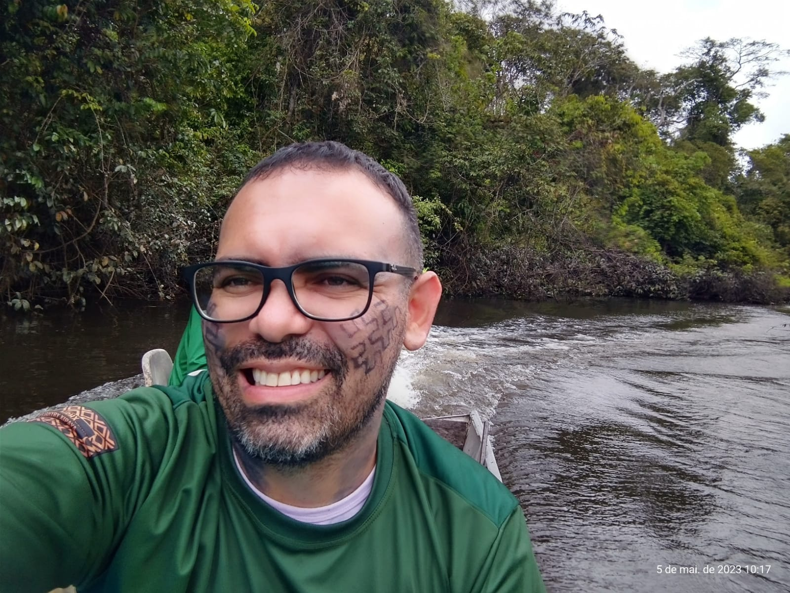

<!-- README.md is generated from README.Rmd. Please edit that file.. -->

<!-- badges: start -->
<!-- badges: end -->

```{r, include = FALSE}
knitr::opts_chunk$set(
  collapse = TRUE,
  comment = "#>"
)
library(magrittr)
repo <- "PPGBC0030-Estatistica-Computacional"
```

<!-- Emprestei a função list_github_files() da Curso-R. (https://github.com/curso-r). A ideia desse readme emprestei da Curso-R. Achei excelente!-->

```{r, include = FALSE}
list_github_files <- function(repo, dir = NULL, ext = NULL) {

  req <- httr::GET(
    paste0(
      "https://api.github.com/repos/DeivisonSouza/",
      repo,
      "/git/trees/master?recursive=1"
    )
  )

  httr::stop_for_status(req)

  arquivos <- unlist(
    lapply(httr::content(req)$tree, "[", "path"),
    use.names = FALSE
  )

  if (!is.null(dir)) {
    arquivos <- grep(dir, arquivos, value = TRUE, fixed = TRUE)
  }

  if (!is.null(ext)) {
    arquivos <- arquivos[grep(paste0(ext, "$"), arquivos)]
  }

  return(arquivos)
}
```

# Seja bem vindo(a)! :deciduous_tree: :smiley: :grin:

:calendar: 27/11 a 01/12/2023

:alarm_clock: **08h00min - 12h30min** (Manhã) e **14h30min a 18h00min** (Tarde)


<div>
  
  
<div>

<div itemscope itemtype="https://schema.org/Person"><a itemprop="sameAs" content="https://orcid.org/0000-0002-2975-0927" href="https://orcid.org/0000-0002-2975-0927" target="orcid.widget" rel="me noopener noreferrer" style="vertical-align:top;">https://orcid.org/0000-0002-2975-0927</a></div>

**Lattes**: [http://lattes.cnpq.br/9063094443073532](http://lattes.cnpq.br/9063094443073532)

**Researchgate**: [https://www.researchgate.net/profile/Deivison-Souza](https://www.researchgate.net/profile/Deivison-Souza)

---------------------------------------------------

# Estatística Computacional (PPGBC0030)

Este repositório guarda os slides em .html, códigos R, arquivos .Rmd, figuras, conjunto de dados (e outros) utilizados na disciplina de **Estatística Computacional (PPGBC0030)** ministrada pelo **Prof. Deivison Venicio Souza** (Laboratório de Manejo Floretal, Tecnologias e Comunidades Amazônicas) no **Programa de Pós-Graduação em Biodiversidade e Conservação (PPGBC)** da Universidade Federal do Pará (UFPA). O curso será ofertado na modalidade de Ensino Presencial no Campus Universitário de Altamira-PA.

# Slides da disciplina

Os slides da disciplina **Estatística Computacional (PPGBC0030)** estão detalhados a seguir.

```{r, echo = FALSE}
knitr::kable(
  tibble::tibble(
    Slide = list_github_files(repo=repo, "Slides/", "html"),
    Link = paste0("https://deivisonsouza.github.io/", repo, "/", Slide)
  ) %>% 
    dplyr::filter(!stringr::str_detect(Slide,
                                       "_files/|_cache/|assets"))
)
```

# Conjunto de dados

Serão usados os seguintes conjuntos na disciplina:

1 - **UPA07DVS.csv** $\rightarrow$ São dados de Inventário Florestal 100% (IF100%) realizado em Área de Manejo Florestal Sustentável na Amazônia brasileira.

2 - **data.csv** $\rightarrow$ É simplesmente uma pequena amostra aleatória de IF100%.

```{r, echo = FALSE}
knitr::kable(
  tibble::tibble(
    Slide = list_github_files(repo=repo, "Slides/data", "csv"),
    Link = paste0("https://deivisonsouza.github.io/", repo, "/", Slide)
  ) %>% 
    dplyr::filter(!stringr::str_detect(Slide,
                                       "file"))
)
```

# Arquivos .R com códigos dos slides

Para facilitar a seguir estão os arquivos .R com os códigos dos slides e as aplicações em bases de dados.

```{r, echo = FALSE}
knitr::kable(
  tibble::tibble(
    Slide = list_github_files(repo=repo, "R/", "R"),
    Link = paste0("https://deivisonsouza.github.io/", repo, "/", Slide)
  ) %>% 
    dplyr::filter(!stringr::str_detect(Slide,
                                       "file"))
)
```


# Facilitador :deciduous_tree:
<div>
  
<div>
<br>

Graduado em :deciduous_tree: **Engenharia Florestal** pela Universidade Federal Rural da Amazônia (2008), Mestre em Ciências Florestais pela Universidade Federal Rural da Amazônia (2011) e Doutor em Engenharia Florestal pela Universidade Federal do Paraná (2020). No período de 2009 a 2011, exerceu o cargo de Analista Ambiental da Secretaria Estadual de Meio Ambiente do Pará, na Gerência de Projetos Agrossilvipastoris. Atualmente, é docente adjunto IV na Universidade Federal do Pará, atuando no curso de graduação em Engenharia Florestal e Programa de Pós-Graduação em Biodiversidade e Conservação. Coordena projetos de pesquisas orientados ao manejo e conservação da biodiversidade, com ênfase no desenvolvimento de tecnologias baseadas em inteligência artificial e visão computacional para o reconhecimento automático de espécies da flora Amazônica. Também tem contribuído em projetos socioambientais junto aos povos originários, em parceria com a Associação Indígena Pyjahyry Xipaya, com ênfase na estruturação e fortalecimento de cadeias de produtos da sociobiodiversidade e gestão territorial e ambiental.

---------------------------------------------------
**Este repositório está licenciado nos termos da licença MIT.**
