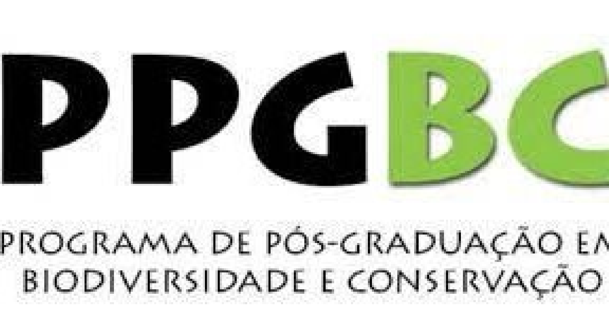

<!-- README.md is generated from README.Rmd. Please edit that file. -->
<!-- badges: start -->
<!-- badges: end -->
<!-- Emprestei a função list_github_files() da Curso-R. (https://github.com/curso-r). A ideia desse readme emprestei da Curso-R. Achei excelente!-->

# Seja bem vindo(a)! :deciduous_tree: :smiley: :grin:

    

 

:calendar: 28, 29 e 30 de Novembro 2022

:calendar: 01 e 02 de Dezembro 2022

:alarm_clock: **08h00min - 13h00min**

<a itemprop="sameAs" content="https://orcid.org/0000-0002-2975-0927" href="https://orcid.org/0000-0002-2975-0927" target="orcid.widget" rel="me noopener noreferrer" style="vertical-align:top;">https://orcid.org/0000-0002-2975-0927</a>

**Lattes**: <http://lattes.cnpq.br/9063094443073532>

**Researchgate**: <https://www.researchgate.net/profile/Deivison-Souza>

# Estatística Computacional (PPGBC0030)

Este repositório guarda os slides em .html, códigos R, arquivos .Rmd,
figuras, conjunto de dados (e outros) utilizados na disciplina de
**Estatística Computacional (PPGBC0030)** ministrada pelo
**Prof. Deivison Venicio Souza** no **Programa de Pós-Graduação em
Biodiversidade e Conservação (PPGBC)** da Universidade Federal do Pará
(UFPA). O curso será ofertado na modalidade de Ensino Presencial no
Campus Universitário de Altamira-PA.

# Slides da disciplina

Os slides da disciplina **Estatística Computacional (PPGBC0030)** estão
detalhados a seguir.

| Slide                             | Link                                                                                                    |
|:----------------------------------|:--------------------------------------------------------------------------------------------------------|
| Slides/00-Programacao.html        | <https://deivisonsouza.github.io/PPGBC0030-Estatistica-Computacional/Slides/00-Programacao.html>        |
| Slides/01-Introducao-RBase.html   | <https://deivisonsouza.github.io/PPGBC0030-Estatistica-Computacional/Slides/01-Introducao-RBase.html>   |
| Slides/02-Importacao-Dados.html   | <https://deivisonsouza.github.io/PPGBC0030-Estatistica-Computacional/Slides/02-Importacao-Dados.html>   |
| Slides/03-Manipulacao-Dados.html  | <https://deivisonsouza.github.io/PPGBC0030-Estatistica-Computacional/Slides/03-Manipulacao-Dados.html>  |
| Slides/04-Visualizacao-Dados.html | <https://deivisonsouza.github.io/PPGBC0030-Estatistica-Computacional/Slides/04-Visualizacao-Dados.html> |
| Slides/05-AED.html                | <https://deivisonsouza.github.io/PPGBC0030-Estatistica-Computacional/Slides/05-AED.html>                |

# Conjunto de dados

Serão usados os seguintes conjuntos na disciplina:

1 - **UPA07DVS.csv**

São dados de Inventário Florestal 100% (IF100%) realizado em Área de
Manejo Florestal Sustentável na Amazônia brasileira.

2 - **data.csv**

É simplesmente uma pequena amostra aleatória de IF100%.

| Slide                    | Link                                                                                           |
|:-------------------------|:-----------------------------------------------------------------------------------------------|
| Slides/data/Cedrela.csv  | <https://deivisonsouza.github.io/PPGBC0030-Estatistica-Computacional/Slides/data/Cedrela.csv>  |
| Slides/data/UPA07DVS.csv | <https://deivisonsouza.github.io/PPGBC0030-Estatistica-Computacional/Slides/data/UPA07DVS.csv> |
| Slides/data/data.csv     | <https://deivisonsouza.github.io/PPGBC0030-Estatistica-Computacional/Slides/data/data.csv>     |

# Arquivos .R com códigos dos slides

Para facilitar a seguir estão os arquivos .R com os códigos dos slides e
as aplicações em bases de dados.

| Slide                               | Link                                                                                                      |
|:------------------------------------|:----------------------------------------------------------------------------------------------------------|
| R/01-Introducao-R.R                 | <https://deivisonsouza.github.io/PPGBC0030-Estatistica-Computacional/R/01-Introducao-R.R>                 |
| R/02-Importacao-Manipulacao-Dados.R | <https://deivisonsouza.github.io/PPGBC0030-Estatistica-Computacional/R/02-Importacao-Manipulacao-Dados.R> |
| R/03-Visualizacao-Dados.R           | <https://deivisonsouza.github.io/PPGBC0030-Estatistica-Computacional/R/03-Visualizacao-Dados.R>           |
| R/04-AED-IF100.R                    | <https://deivisonsouza.github.io/PPGBC0030-Estatistica-Computacional/R/04-AED-IF100.R>                    |
| R/05-RL.R                           | <https://deivisonsouza.github.io/PPGBC0030-Estatistica-Computacional/R/05-RL.R>                           |

# Facilitador :deciduous_tree:

 

**Deivison Venicio Souza** possui graduação em :deciduous_tree:
**Engenharia Florestal** :deciduous_tree: pela Universidade Federal
Rural da Amazônia (2008), Mestrado em Ciências Florestais pela
Universidade Federal Rural da Amazônia (2011) e Doutorado em Engenharia
Florestal pela Universidade Federal do Paraná (2020). No período de 2009
a 2011 exerceu o cargo de Analista Ambiental da Secretaria Estadual de
Meio Ambiente do Pará, na Gerência de Projetos Agrossilvipastoris
(GEPAF), com atuação direta na etapa de análise técnica, para fins de
licenciamento ambiental, de Planos de Manejo Florestal Sustentável
(PMFS), Projetos de Desbastes e Reflorestamento e Supressão Florestal.
Desde 2011 é professor da Faculdade de Engenharia Florestal da
Universidade Federal do Pará, Campus Universitário de Altamira, Pará. É
responsável por ministrar as disciplinas Estatística Básica,
Dendrometria, Experimentação Florestal e Inventário Florestal,
integrantes do desenho curricular do Curso de Graduação em Engenharia
Florestal. Tem experiência na área de Gestão e Manejo dos Recursos
Florestais, com ênfase em Silvicultura de Florestas Naturais, Inventário
Florestal e Mensuração Florestal. Atualmente, seus interesses
científicos incluem o uso da inteligência artificial na conservação da
biodiversidade (com ênfase no uso de visão computacional) e emprego de
técnicas de aprendizado de máquina na modelagem preditiva de variáveis
biométricas, com uso das Linguagens R e Python.
