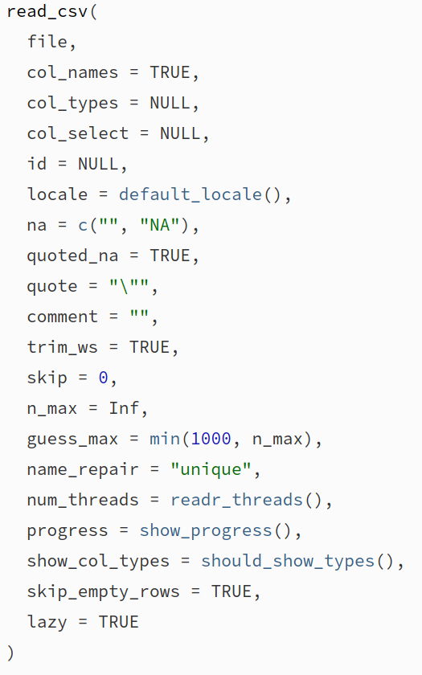
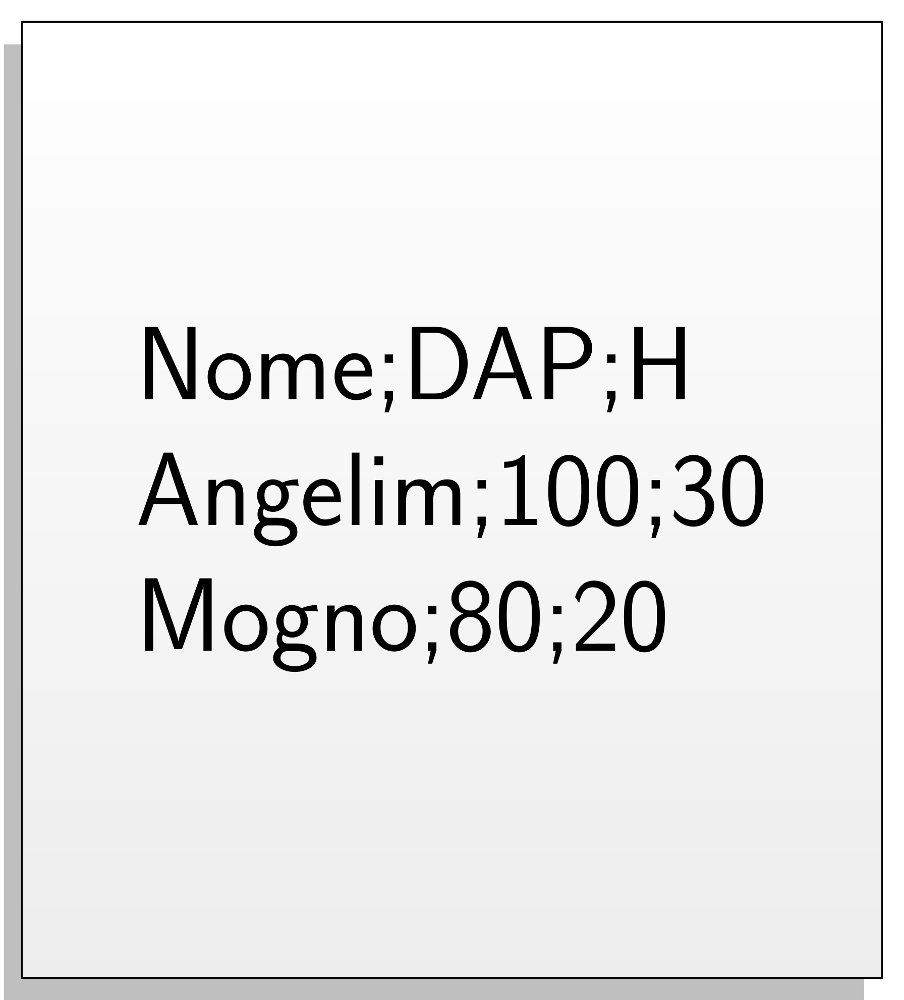
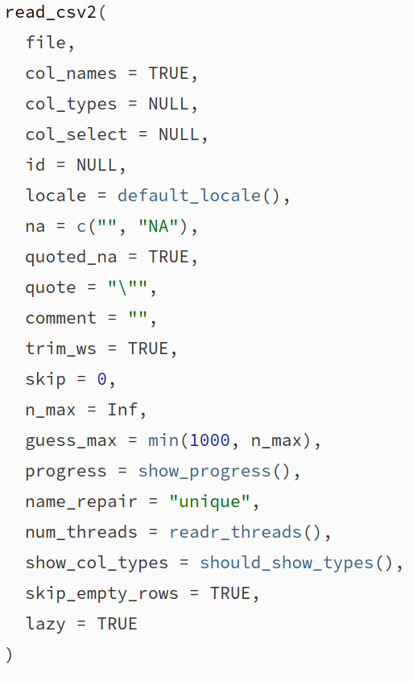
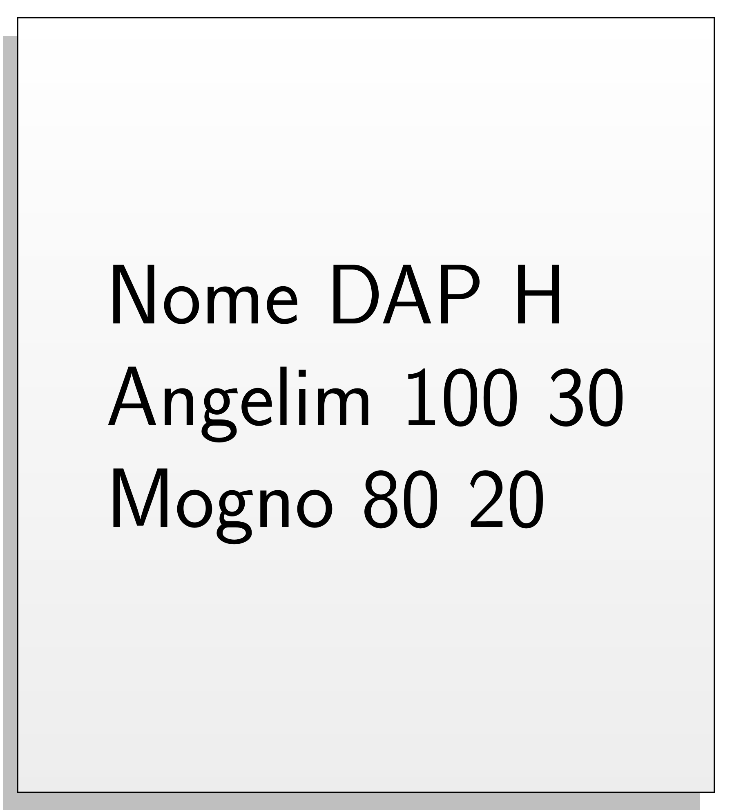
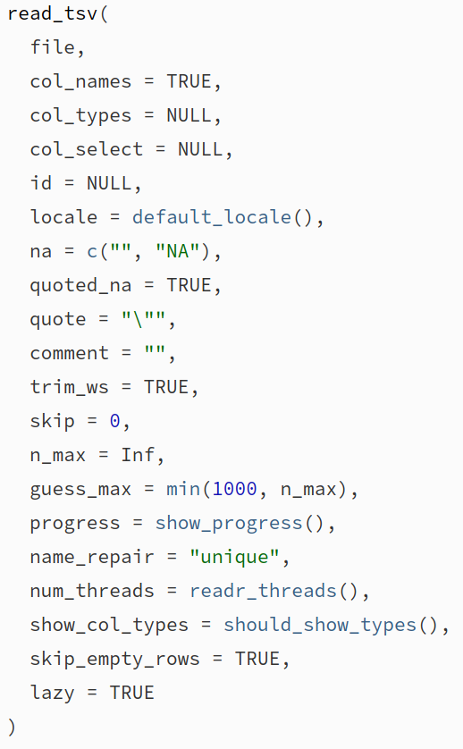
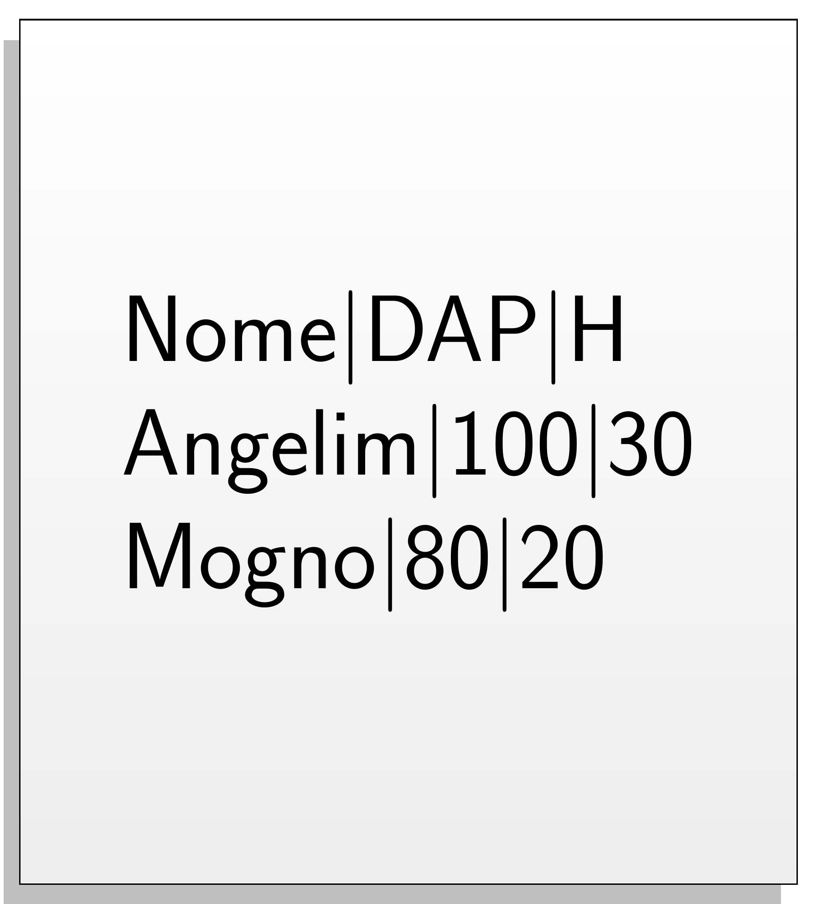
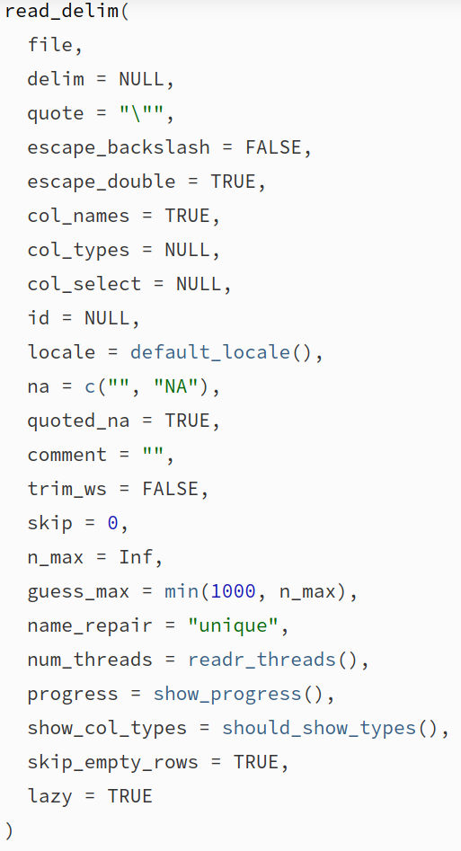

class: title-slide, center, middle
background-image: url(fig/slide-title/ufpa2.png), url(fig/slide-title/ppgbc2.png), url(fig/slide-title/capa.png)
background-position: 90% 90%, 10% 90%
background-size: 250px, 200px, cover

```{r setup, include=FALSE}
knitr::opts_chunk$set(
  fig.showtext = TRUE,
  fig.align = "center", 
  cache = FALSE,
  error = FALSE,
  message = FALSE, 
  warning = FALSE, 
  collapse = TRUE ,
  dpi = 600)
```

```{css, echo=FALSE}
.with-logo::before {
	content: '';
	width: 120px;
	height: 120px;
	position: absolute;
	bottom: 1.3em;
	right: -0.3em;
	background-size: contain;
	background-repeat: no-repeat;
}

.logo-ufpa::before {
	background-image: url(fig/slide-title/ufpa.png);
}

.logo-dplyr::before {
	background-image: url(https://github.com/rstudio/hex-stickers/raw/master/PNG/dplyr.png);
}

.logo-purrr::before {
	background-image: url(https://github.com/rstudio/hex-stickers/raw/master/PNG/purrr.png);
}

.logo-plumber::before {
	background-image: url(https://github.com/rstudio/hex-stickers/raw/master/PNG/plumber.png);
}
```


```{r packages, include=FALSE}
# remotes::install_github("dill/emoGG")
library(tidyverse)
library(ggimage)
library(kableExtra)
```

```{r xaringan-logo, echo=FALSE}
library(xaringanExtra)
use_logo(
  image_url = "fig/slide-title/ppgbc1.jpeg",
  position = css_position(top = "1.5em", right = "0.6em"),
  width = "210px",
  height = "210px"
)

use_scribble() # para escrever nos slides
use_share_again()
use_progress_bar()
#use_animate_all(style = c("slide_down"))

use_extra_styles(
  hover_code_line = TRUE,         #<<
  mute_unhighlighted_code = TRUE  #<<
)
xaringanExtra::use_editable(expires = 1)
#.can-edit[Você pode editar este título de slide]
#.can-edit.key-firstSlideTitle[Change this title and then reload the page]
use_clipboard()
```

```{r icon, echo=FALSE}
#remotes::install_github("mitchelloharawild/icons")
#remotes::install_github('emitanaka/anicon')
#library(icons)
#download_fontawesome()
#download_simple_icons()
```

```{r customDT, echo=F}
CustomDT <- function(data){
  data %>% DT::datatable(editable = 'cell', rownames = FALSE,
                         style = "default",
                         class = "display", width = '180px',
                         caption = '',
     options=list(pageLength = 20, dom = 't', autoWidth = F,
       initComplete = htmlwidgets::JS(
          "function(settings, json) {",
          paste0("$(this.api().table().container()).css({'font-size': '", "9pt", "'});"),
          "}")
       ) 
     )
}
```


<!-- title-slide -->
# .font120[Estatística Computacional <br> (PPGBC0030)]

## `r anicon::faa("pagelines", animate="horizontal", colour="green")` Importação de dados em R`r anicon::faa("pagelines", animate="horizontal", colour="green")`
<br>

#### **Prof. Dr. Deivison Venicio Souza**
##### Universidade Federal do Pará (UFPA) 
##### Faculdade de Engenharia Florestal
##### E-mail: deivisonvs@ufpa.br
<br>
##### 1ª versão: 04/novembro/2022 <br> (Atualizado em: `r format(Sys.Date(),"%d/%B/%Y")`)

---

layout: true
class: with-logo logo-ufpa
<div class="my-header"></div>
<div class="my-footer"><span>Prof. Dr. Deivison Venicio Souza (E-mail: deivisonvs@ufpa.br)&emsp;&emsp;&emsp;&emsp;&emsp; <div3>Estatística Computacional (PPGBC0030)</div3>/ <div2>Módulo 1 - Introdução à Linguagem R</div2> </div>

---

## Objetivos
<br><br>
Ao final desta segunda parte (.blue[Importação de Dados em R]) espera-se que os participantes possam alcançar conhecimentos para...
<br><br>

* Importar e exportar dados no R usando funções do pacote **readr**.
<br><br>

.pull-left-7[
```{r echo=FALSE, out.width='70%', fig.align='center', fig.cap='', dpi=600}
knitr::include_graphics("https://tidyverse.tidyverse.org/articles/tidyverse-logo.png")
```
]

.pull-left-7[
```{r echo=FALSE, out.width='70%', fig.align='center', fig.cap='', dpi=600}
knitr::include_graphics("https://readr.tidyverse.org/logo.png")
```
]

---

## Conteúdo

.pull-left-9[
.font90[
**Parte 1 - Importação e exportação de dados com .orange[readr]**

[1 - Importação de dados no R](#import)

[2 - O pacote readr](#fie)

&nbsp;&nbsp;&nbsp;&nbsp;[2.1 - Funções de importação e exportação](#fie)

[3 - Importação de dados usando o readr](#idur)

&nbsp;&nbsp;&nbsp;&nbsp;[3.1 - Arquivo de valores separados por vírgula](#csv)

&nbsp;&nbsp;&nbsp;&nbsp;[3.2 - Arquivo de valores separados por ponto e vírgula](#csv2)

&nbsp;&nbsp;&nbsp;&nbsp;[3.3 - Arquivo de valores separados por tabulação](#tsv)

&nbsp;&nbsp;&nbsp;&nbsp;[3.4 - Arquivo de valores separados por um delimitador incomum](#delim)

[4 - Importação de dados usando a GUI do Rstudio](#importdata)

]
]

---

layout: false
name: conc
class: inverse, top, right
background-image: url(fig/part1/arara.jpg)
background-size: cover

.font200[**.yellow[Parte 1] <br> .white[Importação de dados <br> com readr]**]

.left[.footnote[.white[Créditos: Imagem de IvaCastro por Pixabay].]]

---

layout: true
class: with-logo logo-ufpa
<div class="my-header"></div>
<div class="my-footer"><span>Prof. Dr. Deivison Venicio Souza (E-mail: deivisonvs@ufpa.br)&emsp;&emsp;&emsp;&emsp;&emsp; <div3>Estatística Computacional (PPGBC0030)</div3>/ <div2>Módulo 1 - Introdução à Linguagem R</div2> </div>

---
name: import
## Importação de dados no R
<br>

.font90[
- A etapa de importação de dados para o R precede a análise de dados.
- Os dados podem ser exportados: i) diretamente para a memória (RAM); ou ii) acessados remotamente.
- O mecanismo de importação depende do formato dos dados.
- Por exemplo, é possível exportar dados nos formatos: .txt, .csv, .xlsx, .ods, SAS, SPSS, etc.
- O R-base possui funções para importação de dados: .green[**read.csv()**] e .green[**read.table()**] (Pacote .blue[**utils**]).
- O tidyverse incorpora o pacote .blue[**readr**], que possui várias funções para importação de dados.
]
<br><br>

.center[**O pacote .blue[readr] será o nosso objeto de estudo!**]

---
name: tidyverse
## Tidyverse: coleção de pacotes R
<br>

```{r echo=FALSE, out.width='90%', fig.align='center', fig.cap='', dpi=600}
knitr::include_graphics("https://www.storybench.org/wp-content/uploads/2017/05/tidyverse.png")
```
.font70[Fonte: https://www.storybench.org/getting-started-with-tidyverse-in-r/]
---
name: fie
## Pacote readr (tidyverse)
<br>

### Funções de importação e exportação

.font80[
- O pacote .blue[readr] está incorporado no tidyverse.
- Possui diversas funções para importação e exportação de dados.
]
<br>

.pull-left-4[
**Funções para importação de dados**
.font80[
```{r echo=T, eval=T}
ls("package:readr") %>% 
  stringr::str_subset("^read_")
```
]
]

.pull-right-4[
**Funções para exportação de dados**
.font80[
```{r echo=T, eval=T}
ls("package:readr") %>% 
  stringr::str_subset("^write_")
```
]
]

---
name: idur
## Pacote readr (tidyverse)
<br>

### Importação de dados usando o readr

- Vamos estudar apenas algumas das principais funções de importação...
<br><br>

.left[
.font80[
**read_csv()** - Importar um arquivo de valores separados por .blue[vírgula] (*Comma-Separated Values*)

**read_csv2()** - Importar um arquivo de valores separados por .blue[ponto e vírgula] (*Semicolon-Separated Values*)

**read_tsv()** - Importar um arquivo de valores separados por .blue[tabulação] (*Tab-Separated Values*)

**read_delim()** - Importar um arquivo de valores separados por um .blue[delimitador incomum]

]
]

---
name: csv
## Pacote readr (tidyverse)
<br>

### Arquivo de valores separados por vírgula .black[(].blue[,].black[)]

- **Função .black[read_csv()]** - Importar arquivos .csv

.pull-left-9[

```{r echo=FALSE, out.width='30%', fig.align='center', fig.cap='', dpi=600}

```

.font80[
```{r echo=T, eval=F}
# Cria o arquivo "file1.csv" e salva em "data"
readr::write_file(x = "Nome,DAP,H\nAngelim,100,30\nMogno,80,20",
                  path = "data/file1.csv")
```
]
]

--

.pull-right-9[
.font80[
**O único argumento obrigatório (file) é o caminho para o arquivo.**

```{r file1, echo=T, eval=F}
# Importa o arquivo "file1"
(file1 <- readr::read_csv(file="data/file1.csv"))
```

```{r ref.label="file1", echo=F, eval=T, collapse=T}
```
]

]

---

## Pacote readr (tidyverse)
<br>

.pull-left-4[
.font80[
### Arquivo de valores separados por vírgula .black[(].blue[,].black[)]

- **Função .black[read_csv()]** - Importar arquivos .csv

A função possui inúmeros argumentos que podem ser especificados.

Execute o comando: **args(**read_csv**)**
]
]


.pull-right-4[
```{r echo=FALSE, out.width='55%', fig.align='center', fig.cap='', dpi=600}

```
]

---

## Pacote readr (tidyverse)
<br>

### Arquivo de valores separados por vírgula .black[(].blue[,].black[)]

- **Função .black[read_csv()]** - Importar arquivos .csv
.font80[
Vamos explorar outros argumentos da função read_csv()...(.green[**col_types**])
]

.pull-left-4[
.font80[
```{r file5, echo=T, eval=F}
# Importa o arquivo "file1"
(file1 <- readr::read_csv(file="data/file1.csv"))
```

```{r ref.label="file5", echo=F, eval=T, collapse=T}
```

**col_types** = É possível usar strings compactas em que cada caractere representa uma coluna.

**c** = character; **i** = integer; **n** = number; **d** = double; **l** = logical; **f** = factor; **D** = date

]
]


--

.pull-right-4[
.font80[
```{r file6, echo=T, eval=F}
# Importa o arquivo "file1"
(file1.mod2 <- readr::read_csv(file="data/file1.csv", 
                          col_types = "fdi")
 )
```

```{r ref.label="file6", echo=F, eval=T, collapse=T}
```
]
]


---

## Pacote readr (tidyverse)
<br>

### Arquivo de valores separados por vírgula .black[(].blue[,].black[)]

- **Função .black[read_csv()]** - Importar arquivos .csv
.font80[
Vamos explorar outros argumentos da função read_csv()...(.green[**col_select**])
]

.pull-left-4[
.font80[
```{r file7, echo=T, eval=F}
# Importa o arquivo "file1"
(file1 <- readr::read_csv(file="data/file1.csv"))
```

```{r ref.label="file7", echo=F, eval=T, collapse=T}
```
]
]

--

.pull-right-4[
.font80[
```{r file8, echo=T, eval=F}
# Importa o arquivo "file1"
(file1.mod3 <- readr::read_csv(
  file = "data/file1.csv", 
  col_select = c(Nome, DAP)
  )
 )
```
```{r ref.label="file8", echo=F, eval=T, collapse=T}
```
]
]

---
name: csv2
## Pacote readr (tidyverse)
<br>

### Arquivo de valores separados por ponto e vírgula .black[(].blue[;].black[)]

- **Função .black[read_csv2()]**
.font80[
Os arquivo separados por ponto e vírgula também têm a extensão .blue[.csv].
]

.pull-left-9[

```{r echo=FALSE, out.width='30%', fig.align='center', fig.cap='', dpi=600}

```

.font80[
```{r echo=T, eval=F}
# Cria o arquivo "file2.csv" e salva em "data"
readr::write_file(x = "Nome;DAP;H\nAngelim;100;30\nMogno;80;20",
                  path = "data/file2.csv")
```
]
]

--

.pull-right-9[
.font80[
**O único argumento obrigatório (file) é o caminho para o arquivo.**

```{r filecsv2, echo=T, eval=F}
# Importa o arquivo "file2"
(file2 <- readr::read_csv2(file="data/file2.csv"))
```

```{r ref.label="filecsv2", echo=F, eval=T, collapse=T}
```
]

]

---

## Pacote readr (tidyverse)

.pull-left-4[
.font80[
### Arquivo de valores separados por ponto e vírgula .black[(].blue[;].black[)]
<br><br>

- **Função .black[read_csv2()]**

A função possui inúmeros argumentos que podem ser especificados.

Execute o comando: **args(**read_csv2**)**
<br><br>

`r anicon::faa("hand-point-right", animate="horizontal")` **Explore os demais argumentos!** `r anicon::faa("home", animate="horizontal")`

]
]

.pull-right-4[
```{r echo=FALSE, out.width='55%', fig.align='center', fig.cap='', dpi=600}

```
]


---
name: tsv
## Pacote readr (tidyverse)
<br>

### Arquivo de valores separados por tabulação .black[(].blue[\t].black[)]

- **Função .black[read_tsv()]** - Importar arquivos (.tsv, .txt)

.pull-left-9[

```{r echo=FALSE, out.width='30%', fig.align='center', fig.cap='', dpi=600}

```

.font80[
```{r echo=T, eval=F}
# Cria o arquivo "file3.tsv" e salva em "data"
readr::write_file(x = "Nome\tDAP\tH\nAngelim\t100\t30\nMogno\t80\t20",
                  path = "data/file3.txt")
```
]
]

--

.pull-right-9[
.font80[
**O único argumento obrigatório (file) é o caminho para o arquivo.**

```{r filetsv, echo=T, eval=F}
# Importa o arquivo "file3"
(file3 <- readr::read_tsv(file="data/file3.txt"))
```

```{r ref.label="filetsv", echo=F, eval=T, collapse=T}
```
]

]

---

## Pacote readr (tidyverse)

.pull-left-4[
.font80[
### Arquivo de valores separados por tabulação .black[(].blue[\t].black[)]
<br><br>

- **Função .black[read_tsv()]** - Importar arquivos (.tsv, .txt)

A função possui inúmeros argumentos que podem ser especificados.

Execute o comando: **args(**read_tsv**)**
<br><br>

`r anicon::faa("hand-point-right", animate="horizontal")` **Explore os demais argumentos!** `r anicon::faa("home", animate="horizontal")`

]
]

.pull-right-4[
```{r echo=FALSE, out.width='55%', fig.align='center', fig.cap='', dpi=600}

```
]


---
name: delim
## Pacote readr (tidyverse)
<br>

### Arquivo de valores separados por um delimitador incomum

- **Função .black[read_delim()]** - Importar arquivos com delimitator de valores específicos

.pull-left-9[

```{r echo=FALSE, out.width='30%', fig.align='center', fig.cap='', dpi=600}

```

.font80[
```{r echo=T, eval=F}
# Cria o arquivo "file4.txt" e salva em "data"
readr::write_file(x = "Nome|DAP|H\nAngelim|100|30\nMogno|80|20",
                  path = "data/file4.txt")
```
]
]

--

.pull-right-9[
.font80[
**O único argumento obrigatório (file) é o caminho para o arquivo.**

```{r filedelim, echo=T, eval=F}
# Importa o arquivo "file4"
(file4 <- readr::read_delim(
  file="data/file4.txt", 
  delim = "|")
 )
```

```{r ref.label="filedelim", echo=F, eval=T, collapse=T}
```
]

]

---

## Pacote readr (tidyverse)

.pull-left-4[
.font80[
### Arquivo de valores separados por um delimitador incomum
<br><br>

- **Função .black[read_delim()]** - Importar arquivos com delimitator de valores específicos

A função possui inúmeros argumentos que podem ser especificados.

Execute o comando: **args(**read_delim**)**
<br><br>

`r anicon::faa("hand-point-right", animate="horizontal")` **Explore os demais argumentos!** `r anicon::faa("home", animate="horizontal")`

]
]

.pull-right-4[
```{r echo=FALSE, out.width='55%', fig.align='center', fig.cap='', dpi=600}

```
]


---
name: importdata
## Pacote readr (tidyverse)
<br>

### Importação de dados usando a GUI do RStudio
<br><br>

.font90[
- Use a Interface Gráfica do Usuário (*Graphical User Interface* - GUI) para importar dados rapidamente.
- RStudio IDE $\rightarrow$ Environment $\rightarrow$ .blue[Import Dataset] $\rightarrow$ From Text (readr).
- É possível também usar funções do R-base e de outros pacotes, como **readxl** (para ler arquivos .blue[.xlsx]).

]

<!--Slide XX -->
---
layout: false
class: inverse, top, right
background-image: url(fig/part1/arara2.jpg)
background-size: cover

.font300[
.yellow[Obrigado!]
]
<br><br>

.white[**Email**:] <a href="mailto:deivisonvs@ufpa.br">.white[deivisonvs@ufpa.br]</a>

.white[**Github**:] <a href="https://github.com/DeivisonSouza">.white[@DeivisonSouza]</a>

.left[.footnote[.white[Créditos: Imagem de ljwong por Pixabay].]]
