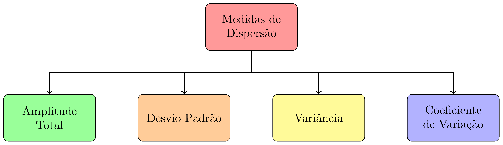
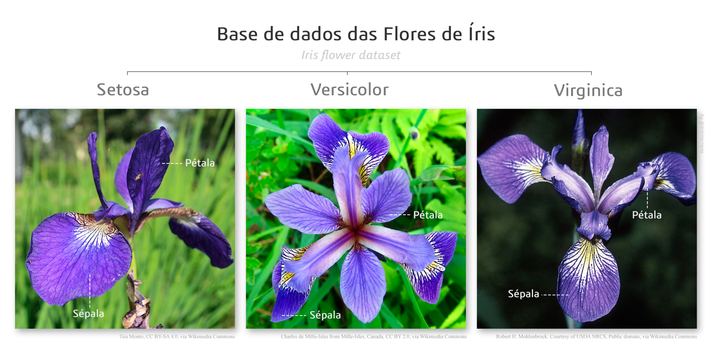

class: title-slide, center, middle
background-image: url(fig/slide-title/ufpa2.png), url(fig/slide-title/ppgbc2.png), url(fig/slide-title/capa.png)
background-position: 90% 90%, 10% 90%
background-size: 250px, 200px, cover

```{r setup, include=FALSE}
knitr::opts_chunk$set(
  fig.showtext = TRUE,
  fig.align = "center", 
  cache = FALSE,
  error = FALSE,
  message = FALSE, 
  warning = FALSE, 
  collapse = TRUE ,
  dpi = 600)
```

```{css, echo=FALSE}
.with-logo::before {
	content: '';
	width: 120px;
	height: 120px;
	position: absolute;
	bottom: 1.3em;
	right: -0.3em;
	background-size: contain;
	background-repeat: no-repeat;
}

.logo-ufpa::before {
	background-image: url(fig/slide-title/ufpa.png);
}

.logo-dplyr::before {
	background-image: url(https://github.com/rstudio/hex-stickers/raw/master/PNG/dplyr.png);
}

.logo-purrr::before {
	background-image: url(https://github.com/rstudio/hex-stickers/raw/master/PNG/purrr.png);
}

.logo-plumber::before {
	background-image: url(https://github.com/rstudio/hex-stickers/raw/master/PNG/plumber.png);
}
```

```{r packages, include=FALSE}
# remotes::install_github("dill/emoGG")
library(tidyverse)
library(ggimage)
library(kableExtra)
```

```{r xaringan-logo, echo=FALSE}
library(xaringanExtra)
use_logo(
  image_url = "fig/slide-title/ppgbc1.jpeg",
  position = css_position(top = "1.5em", right = "0.6em"),
  width = "210px",
  height = "210px"
)

use_scribble() # para escrever nos slides
use_share_again()
use_progress_bar()
#use_animate_all(style = c("slide_down"))

use_extra_styles(
  hover_code_line = TRUE,         #<<
  mute_unhighlighted_code = TRUE  #<<
)
xaringanExtra::use_editable(expires = 1)
#.can-edit[Você pode editar este título de slide]
#.can-edit.key-firstSlideTitle[Change this title and then reload the page]
use_clipboard()
```

<!-- title-slide -->
# .font120[Estatística Computacional <br> (PPGBC0030)]

## `r anicon::faa("pagelines", animate="horizontal", colour="green")` Análise Exploratória de Dados`r anicon::faa("pagelines", animate="horizontal", colour="green")`
<br>

#### **Prof. Dr. Deivison Venicio Souza**
##### Universidade Federal do Pará (UFPA) 
##### Faculdade de Engenharia Florestal
##### E-mail: deivisonvs@ufpa.br
<br>
##### 1ª versão: 07/novembro/2022 <br> (Atualizado em: `r format(Sys.Date(),"%d/%B/%Y")`)

---
layout: true
class: with-logo logo-ufpa
<div class="my-header"></div>
<div class="my-footer"><span>Prof. Dr. Deivison Venicio Souza (E-mail: deivisonvs@ufpa.br)&emsp;&emsp;&emsp;&emsp;&emsp; <div3>Estatística Computacional (PPGBC0030)</div3>/ <div2>Módulo 3 - Análise Exploratória de Dados</div2> </div>

---

## Objetivos
<br><br>
Ao final desta aula (.blue[Análise Exploratória de Dados]) espera-se que o discente seja capaz de...

* Recordar terminologias e conceitos básicos de estatística;
* Aprender a realizar uma análise exploratória de dados usando a linguagem R.

---

## Conteúdo

.pull-left-4[
**Parte 1 - Terminologias e conceitos básicos**

[1 - O que é estatística?](#Est)

[2 - Estatística descritiva e Estatística inferêncial](#DI)

[3 - População e Amostra](#PA)

[4 - Variável e Parâmetro](#VP)

[5 - Tipos de Variáveis](#TV)
]

.pull-right-2[
.pull-down[
**Parte 2 - Medidas de tendência central (ou posição)**

[1 - Conceito e importância](#CI)

[2 - Moda](#Mo)

[3 - Mediana](#Md)

[4 - Média Aritmética](#Me)
]
]

---

## Conteúdo

.pull-left-4[
**Parte 3 - Medidas de dispersão (ou variabilidade)**

[1 - Conceito e importância](#CId)

[2 - Amplitude Total](#AT)

[4 - Variância](#Var)

[5 - Desvio Padrão](#Dp)

[6 - Coeficiente de Variação](#CV)
]

.pull-right-2[
.pull-down[
**Parte 4 - AED - Iris Flower**

[1 - AED: Iris Flower](#iris)

[2 - Atividade prática](#ap)

]
]

---

## Leitura complementar
<br>

.pull-left-4[
**Livro recomendado**
<br><br>

Morettin, Pedro Alberto; Bussab, Wilton Oliveira. **Estatística básica**. 9 ed., São Paulo: Saraiva, 2017, 554p.
<br><br>

**Parte 1** - Análise Exploratória de Dados (Capítulos 2 e 3).
<br><br>

Dados, códigos R (e outros) podem ser acessados em:

**Link**: <a href="https://www.ime.usp.br/~pam/EstBas.html">Estatística básica</a>

]

.pull-right-4[
```{r, echo=FALSE, out.width='60%', fig.align='center', fig.cap='', dpi=600}
knitr::include_graphics('fig/part5/Livro-Bussab.jpeg')
```
]

---

layout: false
name: term
class: inverse, top, right
background-image: url(fig/slide-title/secao.png)
background-size: cover

<br><br><br>

.right[.font150[**.green[Módulo 3] <br> Análise Exploratória de Dados**]]

<br><br>

.right[.font150[**.green[Parte 1] - Terminologias e conceitos básicos**]]
<br>

.right[.brown[.font120[População, Amostra, Variável, etc.]]]

<!-- Slide XX -->
---
layout: true
class: with-logo logo-ufpa
<div class="my-header"></div>
<div class="my-footer"><span>Prof. Dr. Deivison Venicio Souza (E-mail: deivisonvs@ufpa.br)&emsp;&emsp;&emsp;&emsp;&emsp; <div3>Estatística Computacional (PPGBC0030)</div3>/ <div2>Módulo 3 - Análise Exploratória de Dados</div2> </div>

---

## Terminologias e conceitos básicos

<br>

.shadow3[
### Conceito

A estatística serve para ajudar na **descrição de fenômenos** e na **tomada de decisões**.
]

<br>

### Divisões da estatística

A estatística é, em geral, dividida em dois grandes grupos:

1. Estatística Descritiva
2. Estatística Inferencial

---

## Terminologias e conceitos básicos

<br>

### Estatística Descritiva

É a parte da estatística que lida com a **organização**, **resumo** e **apresentação** de dados (Ferreira, 2009).

<br>

`r anicon::faa("hand-point-right", animate="horizontal")` .blue[**Os dados podem ser resumidos de forma numérica ou gráfica.**]

---

## Terminologias e conceitos básicos
<br>

.left-column[

```{r , echo=FALSE, eval=TRUE}
library(dplyr)

data <- data.table::fread("data/Cedrela.csv")

# data %>%
#   knitr::kable(format= "html")

data %>% 
   DT::datatable(editable = 'cell', rownames = FALSE, style = "default",
                 class = "display", width = '350px',
                 caption = 'Dados de Cedrela odorata.',
     options=list(pageLength = 10, dom = 'tip', autoWidth = F,
       initComplete = htmlwidgets::JS(
          "function(settings, json) {",
          paste0("$(this.api().table().container()).css({'font-size': '", "12pt", "'});"),
          "}")
       ) 
     )
```
]

.right-column[

### Como extrair informações descritivas?

* Calcular medidas descritivas quantitativas.

```{r}
# Usando funções da linguagem R
mean(data$D)
sd(data$D)
var(data$H)
table(data$QF)
```

]

---

## Terminologias e conceitos básicos
<br>

.left-column[

### Como extrair informações descritivas?

* Usar representações gráficas

```{r g1, echo=TRUE, eval=FALSE}
# Criando um BoxPlot Univariado

g1 <- data %>% 
  ggplot(aes(x = 1, y = D)) + 
  geom_boxplot() + 
  xlab(NULL) + 
  theme_bw() +
  theme(axis.text.x = element_blank(),
        axis.ticks.x = element_blank())

plotly::ggplotly(g1)

```

]

.right-column[

```{r ref.label="g1", echo=FALSE, eval=TRUE, collapse=T, fig.width=.8, fig.height=.8, fig.align='center', fig.cap='', dpi=600}
```

]

---

## Terminologias e conceitos básicos
<br>

.left-column[

### Como extrair informações descritivas?

* Usar representações gráficas

```{r g2, echo=TRUE, eval=FALSE}
# Criando um Hitograma Univariado

g2 <- data %>%
  ggplot(aes(x = H)) + 
  geom_histogram(bins = 5, fill="#69b3a2", 
                 color="#e9ecef", alpha=0.9) +
  theme_bw()

plotly::ggplotly(g2)

```

]

.right-column[

```{r ref.label="g2", echo=FALSE, eval=TRUE, collapse=T, fig.width=.8, fig.height=.8, fig.align='center', fig.cap='', dpi=600}
```

]

---

## Terminologias e conceitos básicos
<br>

.left-column[

### Como extrair informações descritivas?

* Usar representações gráficas

```{r g3, echo=TRUE, eval=FALSE}
# Criando um Scatterplot

g3 <- data %>%
  ggplot(aes(x=D, y=V, color=QF)) +
      geom_point(size = 3) +
      theme(legend.position="none") 

plotly::ggplotly(g3)
  
```

]

.right-column[

```{r ref.label="g3", echo=FALSE, eval=TRUE, collapse=T, fig.width=.8, fig.height=.8, fig.align='center', fig.cap='', dpi=600}
```

]

---

## Terminologias e conceitos básicos

<br>

### Estatística Inferencial (ou Indutiva)

É a parte da estatítica que objetiva inferir sobre uma **população** a partir da observação de uma parte dela (**amostra**).

---

## Terminologias e conceitos básicos

.left-column[
### População

```{r eval = T, echo = F, fig.width=.8, fig.height=.8}

grid <- expand.grid(
  x = seq(0, 20, length = 15),
  y = seq(0, 3, length = 15)
  )

img <- "fig/part5/pinus1.png"

grid %>% 
  ggplot(aes(x, y)) + 
  geom_image(image=img, size=.1) +
  theme_bw() +
  theme(axis.text = element_blank(),
        axis.ticks = element_blank(),
        axis.title=element_blank())

```
]

.right-column[
### Amostra

```{r eval = T, echo = F, fig.width=.8, fig.height=.8}

grid <- expand.grid(
  x = seq(0, 20, length = 15),
  y = seq(0, 3, length = 15)
  ) %>%
  mutate(image = sample(c("fig/part5/pinus1.png",
                          "fig/part5/pinus2.png"),
                        size = length(y), replace = TRUE))
grid %>%
  ggplot(aes(x, y)) + 
  geom_image(aes(image=image), size=.1) +
  theme_bw() +
  theme(axis.text = element_blank(),
        axis.ticks = element_blank(),
        axis.title=element_blank())

```

]


---

## Terminologias e conceitos básicos
<br>

### Tipos de Variáveis

```{r, echo=FALSE, out.width='60%', fig.align='center', fig.cap='', dpi=600}
knitr::include_graphics('fig/part5/TV.png')
```

---

## Terminologias e conceitos básicos
<br>

### Variáveis Qualitativas (ou Categóricas)

A variável é qualitativa (ou categórica) quando seus valores são distribuídos em categorias mutuamente exclusivas (Vieira, 2010).

--
<br><br>

Estas podem ser classificadas em dois tipos: 

`r anicon::faa("hand-point-right", animate="horizontal")` 1 - Variável nominal

`r anicon::faa("hand-point-right", animate="horizontal")` 2 - Variável ordinal


---

## Terminologias e conceitos básicos
<br>

### Variáveis Qualitativas (ou Categóricas)
<br>

#### Variável Nominal

A variável é nominal quando seus valores se distribuem em categorias mutuamente exclusivas, indicadas em qualquer ordem (Vieira, 2010).

--
<br><br>
#### Variável Ordinal

A variável é ordinal quando os dados são distribuídos em categorias mutuamente exclusivas que possuem ordem (Vieira, 2010).


---

## Terminologias e conceitos básicos
<br>

### Variáveis Quantitativas (ou Numéricas)

Uma variável quantitativa (ou numérica) é expressa por números que têm significado em uma escala numérica (Vieira, 2010).

--
<br><br>
Estas podem ser classificadas em dois tipos: 

`r anicon::faa("hand-point-right", animate="horizontal")` 1 - Variável discreta

`r anicon::faa("hand-point-right", animate="horizontal")` 2 - Variável contínua

---

## Terminologias e conceitos básicos
<br>

### Variáveis Quantitativas (ou Contínuas)
<br>

#### Variável Discreta

A variável é discreta quando só pode assumir alguns valores em um dado intervalo (Vieira, 2010).

--
<br><br>
#### Variável Contínua

A variável é contínua quando pode assumir qualquer valor em um dado intervalo (Vieira, 2010).

---

## Terminologias e conceitos básicos
<br>

### Vamos praticar...

1 - Dada a tabela abaixo preencha a coluna "Tipo":

.left-column[

```{r echo=FALSE, eval=T}
df <- data.frame(
  Variável = c("Nº de Rebrotos",
        "Peso de fruto",
        "Altura da árvore",
        "Volume de madeira",
        "Grau de iluminação de copas",
        "Forma de copas",
        "Qualidade de fuste"
        ), Tipo = c(NA), Subtipo = c(NA))

df %>% 
   DT::datatable(editable = 'cell', rownames = FALSE, style = "default",
                 class = "display", width = '450px',
                 caption = '',
     options=list(pageLength = 10, dom = 'tip', autoWidth = F,
       initComplete = htmlwidgets::JS(
          "function(settings, json) {",
          paste0("$(this.api().table().container()).css({'font-size': '", "12pt", "'});"),
          "}")
       ) 
     )
```
]

--

.right-column[

```{r echo=FALSE, eval=T}
df <- data.frame(
  Variável = c(
    "Biomassa",
    "Mês de observação",
    "Diâmetro do coleto",
    "Nome botânico",
    "Tipos de frutos (Qto à deiscência)",
    "Diâmetro da árvore",
    "Nº de sementes germinadas"
        ), Tipo = c(NA), Subtipo = c(NA))

df %>% 
   DT::datatable(editable = 'cell', rownames = FALSE, style = "default",
                 class = "display", width = '450px',
                 caption = '',
     options=list(pageLength = 10, dom = 'tip', autoWidth = F,
       initComplete = htmlwidgets::JS(
          "function(settings, json) {",
          paste0("$(this.api().table().container()).css({'font-size': '", "12pt", "'});"),
          "}")
       ) 
     )
```

]

---

layout: false
name: mtc
class: inverse, top, right
background-image: url(fig/slide-title/secao.png)
background-size: cover

<br><br><br>

.right[.font150[**.green[Módulo 3] <br> Análise Exploratória de Dados**]]

<br><br>

.right[.font150[**.green[Parte 2] - Medidas de tendência central (ou posição)**]]
<br>

.right[.brown[.font120[Média, Mediana, Moda, Quartis]]]

---
layout: true
class: with-logo logo-ufpa
<div class="my-header"></div>
<div class="my-footer"><span>Prof. Dr. Deivison Venicio Souza (E-mail: deivisonvs@ufpa.br)&emsp;&emsp;&emsp;&emsp;&emsp; <div3>Estatística Computacional (PPGBC0030)</div3>/ <div2>Módulo 3 - Análise Exploratória de Dados</div2> </div>

---

## Medidas de tendência central (ou posição)
<br>

### Conceito

São medidas que objetivam representar o ponto central (ou de equilíbrio) de uma distribuição de dados.

--
<br>
### Principais medidas de posição
```{r, echo=FALSE, out.width='60%', fig.align='center', fig.cap='', dpi=600}
knitr::include_graphics('fig/part5/MTC.png')
```

---

## Medidas de tendência central (ou posição)
<br>

### Moda (Mo) - Conceito

É o valor que aparece mais frequentemente em um conjunto de dados.

--
<br><br>

Qual a moda para a série de dados abaixo?

**{1, 3, 0, 0, 2, 4, 1, 2, 5, 6, 8, 1, 2, 2, 0}**

--
<br><br>

`r anicon::faa("hand-point-right", animate="horizontal")` **Como determinar a moda de um conjunto de dados?**

---

## Medidas de tendência central (ou posição)
<br>

### Moda (Mo) - Como determinar?

.left-column[
- Calcular a frequência de cada valor.
- A moda é o valor mais frequente.
<br><br>

.center[**{1, 3, 0, 0, 2, 4, 1, 2, 5, 6, 8, 1, 2, 2, 0}**]

]

--

.right-column[
```{r echo=F, eval=T}
df <- data.frame(Valor = c(0, 1, 2, 3, 4, 5, 6, 8),
                 "Frequência" = c(NA)
)

df %>% 
   DT::datatable(editable = 'cell', rownames = FALSE, style = "default",
                 class = "display", width = '450px',
                 caption = '',
     options=list(pageLength = 10, dom = 'tip', autoWidth = F,
       initComplete = htmlwidgets::JS(
          "function(settings, json) {",
          paste0("$(this.api().table().container()).css({'font-size': '", "12pt", "'});"),
          "}")
       ) 
     )
```

]

---

## Medidas de tendência central (ou posição)
<br>

### Moda (Mo) - Usando a linguagem R
<br>

`r anicon::faa("hand-point-right", animate="horizontal")` **A linguagem R não possui uma função nativa para calcular a moda.**

`r anicon::faa("hand-point-right", animate="horizontal")` **Mas, pode-se usar a função** `table()` **para gerar uma tabela de frequências absolutas. Assim, a moda pode ser facilmente identificada.**

```{r echo=T, eval=T}
# Cria um vetor
x <- c(1, 3, 0, 0, 2, 4, 1, 2, 5, 6, 8, 1, 2, 2, 0)

# Usar a função "table"
table(x)

```

---

## Medidas de tendência central (ou posição)
<br>

### Moda (Mo) - Usando a linguagem R

.left-column[
- A função `table()`: gera uma tabela de frequências simples. 
- Mas, pode-se criar uma função para retornar o valor modal.
]

.right-column[
```{r echo=T, eval=T}
# Cria um vetor
x <- c(1, 3, 0, 0, 2, 4, 1, 2, 5, 6, 8, 1, 2, 2, 0)

# Uma função para obter a moda
mod <- function(v) {
   uniq <- unique(v)
   uniq[which.max(tabulate(match(v, uniq)))]
}

# Aplicando a função "mod" ao vetor "x"
mod(x)
```
]

---

## Medidas de tendência central (ou posição)
<br>

### Moda (Mo) - Usando a linguagem R

.left-column[
`r anicon::faa("hand-point-right", animate="horizontal")` Podem existir séries de dados em que nenhum valor aparece mais vezes que outros. Nestes casos, diz-se que o conjunto de dados **não possui moda** ou é **amodal**.

<br>

Qual a moda para a série de dados abaixo?

.center[**{1, 8, 6, 5, 4, 3, 0, 3, 0, 4, 5, 6, 8, 2, 1,2}**]
]

.right-column[

```{r echo=T, eval=T}
# Cria um vetor
y <- c(1, 8, 6, 5, 4, 3, 0, 3, 0, 4, 5, 6, 8, 2, 1, 2)

# Usar a função "table"
table(y)

```
]

---

## Medidas de tendência central (ou posição)
<br>

### Moda (Mo) - Variáveis qualitativas

.left-column[
`r anicon::faa("hand-point-right", animate="horizontal")` A moda pode ser determinada para variáveis qualitativas, ao contrário da média e mediana, por exemplo.

Seja o vetor de nomes de espécies de árvores:

**{Marupa, Angelim, Tauari, Marupa, 
  Angelim, Tauari, Marupa, Angelim,
  Angelim, Angelim, Cedro, Cedro, 
  Cedro, Tauari, Tauari, Marupa}**

]

.right-column[
```{r echo=T, eval=T}
# Cria um vetor
esp <- c(
  "Marupa", "Angelim", "Tauari", "Marupa", 
  "Angelim", "Tauari", "Marupa", "Angelim",
  "Angelim", "Angelim", "Cedro", "Cedro", 
  "Cedro", "Tauari", "Tauari", "Marupa")

# Usar a função "table"
table(esp)
```

]

---

## Medidas de tendência central (ou posição)
<br>

### Moda (Mo) - Classificação

Um conjunto de dados pode ser classificado em função da ocorrência (ou não) de **Moda**:

<br>

```{r, echo=FALSE, out.width='60%', fig.align='center', fig.cap='', dpi=600}
knitr::include_graphics('fig/part5/Mo.png')
```

---

## Medidas de tendência central (ou posição)
<br>

### Moda (Mo) - Classificação

- **Amodal**: Conjunto de dados que **não apresenta moda**. Isto é, nenhum dos valores contidos no conjunto predomina sobre os demais.

--
<br><br>
- **Unimodal**: Conjunto de dados que **apresenta uma única moda**. Isto é, apenas um dos elementos do conjunto de dados predomina sobre os demais.

--
<br><br>
- **Bimodal**: Conjunto de dados que **apresenta duas modas**. Isto é, dois dos valores contidos no conjunto de dados predominam sobre os demais;

--
<br><br>
- **Multimodal**: Conjunto de dados que **apresenta mais de duas modas**. Isto é, mais de dois dos elementos do conjunto de dados predominam sobre os demais.

---

## Medidas de tendência central (ou posição)
<br>

### Moda (Mo) - Vamos praticar...

.left-column[
Série I: {1, 3, 0, 0, 2, 4, 1, 2, 5, 6, 8, 1, 2, 0}

Série II: {1,1, 3, 0, 0, 2, 4, 1, 2, 5, 6, 8, 1, 2, 2, 0}

Série III: {1, 6, 8, 6, 5, 4, 3, 0, 3, 3, 0, 4, 4, 5, 6, 8, 2, 1, 1}

Série IV: {1, 6, 8, 8, 8, 6, 5, 5, 5, 4, 3, 0, 3, 3, 0, 4}

]

--

.right-column[
```{r echo=T, eval=T}
# Criar os vetores
S1 <- c(1, 3, 0, 0, 2, 4, 1, 2, 5, 6, 8, 1, 2, 0)
S2 <- c(1,1, 3, 0, 0, 2, 4, 1, 2, 5, 6, 8, 1, 2, 2, 0)
S3 <- c(1,6, 8, 6, 5, 4, 3, 0, 3, 3, 0, 4, 4, 5, 6, 8, 2, 1,1)

table(S1)
table(S2)
table(S3)
```

]

---

## Medidas de tendência central (ou posição)
<br>

### Moda (Mo) 
<br>

#### Vantagens

- Fácil de ser calculada;
- É a única medida de tendência central que pode ser usada para variáveis qualitativas;e
- Não é influenciada por valores extremos (*outliers*).

#### Limitações

- Pode não ser representativa; e
- Pode mudar se inserirmos novas observações.

---

## Medidas de tendência central (ou posição)
<br>

### Mediana (Md) - Conceito (Fávero et al., 2009)

<br>

É o valor que ocupa a posição central de uma série de dados ordenados de forma crescente. Ou seja, em que 50% dos elementos devem estar abaixo da mediana e 50% devem estar acima da mediana.

--
<br><br>

**É o valor que divide a série de dados ordenados em duas partes iguais.**

---

## Medidas de tendência central (ou posição)
<br>

### Mediana (Md) - Como determinar?
<br>

`r anicon::faa("hand-point-right", animate="horizontal")` A determinação da Mediana (Md) requer encontrar o(s) elemento(s) que divide(m) os dados ordenados em duas partes iguais.

`r anicon::faa("hand-point-right", animate="horizontal")` Em geral, existem duas fórmulas para encontrar esse(s) elemento(s). 

`r anicon::faa("hand-point-right", animate="horizontal")` O uso de cada uma é função do número de observações no conjunto de dados.

--

.left-column[

- **Número ímpar de observações**

$$
\Large
E = \frac{n + 1}{2}
$$
]

.right-column[

- **Número par de observações**

$$
\Large
E = \frac{\left [ \frac{n}{2} + \left ( \frac{n}{2} + 1 \right ) \right ]}{2}
$$
]

---

## Medidas de tendência central (ou posição)
<br>

### Mediana (Md) - Número ímpar de observações

.left-column[
Seja a série de dados S1:

**S1 = {1, 3, 0, 0, 2, 4, 1, 2, 5, 6, 8, 1, 2, 2, 0}**
<br><br>

**Qual a mediana (Md)?**

]

.right-column[
**Procedimentos:**

**Passo 1**: Ordenar o conjunto de dados:

.green[S1 = {0, 0, 0,1, 1, 1, 2, 2, 2, 2, 3, 4, 5, 6, 8}]

**Passo 2**: Encontrar o elemento central (E):

$$
\normalsize
E = \frac{n + 1}{2} = \frac{15 + 1}{2} = 8
$$
**Interpretação**: O 8º elemento da série ordenada de dados é a mediana. $Md = 2$

.green[S1 = {0, 0, 0, 1, 1, 1, 2, .red[2], 2, 2, 3, 4, 5, 6, 8}]

]

---

## Medidas de tendência central (ou posição)
<br>

### Mediana (Md) - Número par de observações

.left-column[
Seja a série de dados S2:

**S2 = {1, 3, 0, 0, 2, 4, 1, 5, 6, 8, 1, 0}**
<br><br>

**Qual a mediana (Md)?**

]

.right-column[
**Procedimentos:**

**Passo 1**: Ordenar o conjunto de dados:

.green[S2 = {0, 0, 0, 1, 1, 1, 2, 3, 4, 5, 6, 8}]

**Passo 2**: Encontrar o elemento central (E):

$$
\small
E = \frac{\left [ \frac{n}{2} + \left ( \frac{n}{2} + 1 \right ) \right ]}{2} = \frac{\left [ \frac{12}{2} + \left ( \frac{12}{2} + 1 \right ) \right ]}{2} = \frac{\left (6 + 7 \right )}{2}=6,5
$$
**Interpretação**: A mediana é a média aritmética entre o 6º e 7º elementos da série ordenada. $Md = 1,5$

.green[S2 = {0, 0, 0, 1, 1, .red[1, 2], 3, 4, 5, 6, 8}]

]


---

## Medidas de tendência central (ou posição)
<br>

### Mediana (Md) - Usando a linguagem R

.left-column[

`r anicon::faa("hand-point-right", animate="horizontal")` O R-base possui uma função para calcular a mediana: `median()`.

`r anicon::faa("hand-point-right", animate="horizontal")` Esta função pertence ao pacote "stats".
<br><br>

Então, sejam as series:

**S1 = {1, 3, 0, 0, 2, 4, 1, 2, 5, 6, 8, 1, 2, 2, 0}**

**S2 = {1, 3, 0, 0, 2, 4, 1, 5, 6, 8, 1, 0}**

]

.right-column[

```{r echo=T, eval=T}
# Criar os vetores
S1 <- c(1, 3, 0, 0, 2, 4, 1, 2, 5, 6, 8, 1, 2, 2, 0)
S2 <- c(1, 3, 0, 0, 2, 4, 1, 5, 6, 8, 1, 0)

# Calcula a mediana
median(S1)
median(S2)
```

]

---

## Medidas de tendência central (ou posição)
<br>

### Mediana (Md) - Propriedades
<br>
- **Estável**: Não sofre influência de valores discrepantes (*outliers*). Devido a isso, quando a distribuição amostral é assimétrica, a utilização da mediana torna-se mais interessante.

--
<br><br>
- **Número par de observações**: Nestes casos, a mediana será sempre a média aritmética dos dois elementos centrais dos dados ordenados;

--
<br><br>
- **Número ímpar de observações**: Nestes casos, haverá coincidência da mediana com um dos elementos dos dados ordenados.

---

## Medidas de tendência central (ou posição)
<br>

### Média Aritmética - Conceito
<br>

**Matemático**: É a razão entre a soma de todos os valores assumidos pela variável e o número de observações.

É a medida de tendência central mais comum, intensa e extensivamente utilizada (Ferreira, 2009).

--
<br><br>
`r anicon::faa("hand-point-right", animate="horizontal")` A média amostral é representada por $\Large\bar{x}$ (lê-se "X-barra").

`r anicon::faa("hand-point-right", animate="horizontal")` A média populacional é representada por $\Large\mu$ (lê-se "mi").

---

## Medidas de tendência central (ou posição)
<br>

### Média Aritmética - Expressão matemática do estimador

As expressões matemáticas para os estimadores de média aritmética (amostral e populacional) são: 

<br> <br>

.left-column[

- **Média aritmética amostral**
$$
\Large
\bar{x} = \frac{x_1 + x_2 +...+x_n}{n}
$$
]

.right-column[

- **Média aritmética populacional**
$$
\Large
\mu = \frac{x_1 + x_2 +...+x_N}{N}
$$
]


---

## Medidas de tendência central (ou posição)
<br>

### Média Aritmética - Expressão matemática

Uma forma simplificada da expressão matemática é:

.left-column[
- **Média aritmética amostral**
$$
\Large
\bar{x} = \frac{1}{n}\sum_{i=1}^{n}x_i
$$
- **Média aritmética populacional**
$$
\Large
\mu = \frac{1}{N}\sum_{i=1}^{N}X_i
$$
]


.right-column[
Em que:

$\sum$ (lê-se sigma) = Símbolo de somatório.

$i$ = índice de variação dos elementos que deverão ser somados.

$N$ = Número total de elementos da população.

$n$ = Número total de elementos da amostra.

$x$ = Variável quantitativa objeto de estudo.
]

---

## Medidas de tendência central (ou posição)
<br>

### Vamos praticar...

.left-column[
```{r echo=F, eval=T}
#df <- read.table("clipboard", sep="\t", header=T)

df <- data.frame(
  QF = c("I", "II", "III", "III", "I", 
         "II", "I", "III", "II", "I"), 
    H = c(17.5, 16.2, 15.2, 18.0, 17.0, 
        18.4, 13.0, 18.0, 17.0, 17.3),
  D = c(16.07, 13.24, 17.89, 13.11, 14.36, 
        11.27, 8.50, 14.87, 14.93, 15.47),
  V = c(0.2445, 0.1634, 0.2956, 0.1734, 0.1967, 
        0.1256, 0.0659, 0.2345, 0.2346, 0.2298))

df %>% 
   DT::datatable(editable = 'cell', rownames = FALSE, style = "default",
                 class = "display", width = '450px',
                 caption = '',
     options=list(pageLength = 10, dom = 'tip', autoWidth = F,
       initComplete = htmlwidgets::JS(
          "function(settings, json) {",
          paste0("$(this.api().table().container()).css({'font-size': '", "12pt", "'});"),
          "}")
       ) 
     )

```

]

.right-column[
**Questão proposta**

Suponha que foram medidas 10 árvores em um povoamento de *Tectona grandis*, cujos dados estão abaixo. Assim, pede-se:

a) Determinar a mediana e a média aritmética para as variáveis contínuas.

b) Determinar a moda para a variável qualidade de fuste.

Obs.: Faça os cálculos manuais e usando a linguagem R.

]

---

## Medidas de tendência central (ou posição)
<br>

### Vamos praticar...

.left-column[
```{r echo=F, eval=T}
#df <- read.table("clipboard", sep="\t", header=T)

df <- data.frame(
  QF = c("I", "II", "III", "III", "I", 
         "II", "I", "III", "II", "I"), 
    H = c(17.5, 16.2, 15.2, 18.0, 17.0, 
        18.4, 13.0, 18.0, 17.0, 17.3),
  D = c(16.07, 13.24, 17.89, 13.11, 14.36, 
        11.27, 8.50, 14.87, 14.93, 15.47),
  V = c(0.2445, 0.1634, 0.2956, 0.1734, 0.1967, 
        0.1256, 0.0659, 0.2345, 0.2346, 0.2298))

df %>% 
   DT::datatable(editable = 'cell', rownames = FALSE, style = "default",
                 class = "display", width = '450px',
                 caption = '',
     options=list(pageLength = 10, dom = 'tip', autoWidth = F,
       initComplete = htmlwidgets::JS(
          "function(settings, json) {",
          paste0("$(this.api().table().container()).css({'font-size': '", "12pt", "'});"),
          "}")
       ) 
     )
```

]

.right-column[
**Cálculos manuais - Mediana**

$$
\small
\small
E = \frac{\left [ \frac{10}{2} + \left ( \frac{10}{2} + 1 \right ) \right ]}{2} = \frac{\left (5 + 6 \right )}{2}=5,5
$$

- Ordenar os vetores
.font65[
D = {8.50, 11.27, 13.11, 13.24, .green[14.36, 14.87], 14.93, 15.47, 16.07, 17.89}

H = {13.0, 15.2, 16.2, 17.0, .green[17.0, 17.3], 17.5, 18.0, 18.0, 18.4} 

V = {0.0659, 0.1256, 0.1634, 0.1734, .green[0.1967, 0.2298], 0.2345, 0.2346, 0.2445, 0.2956}

]
- Mediana?

$Md_D$ = **14.615**; $Md_H$ = **17.15**; $Md_V$ = **0.21325**
]

---

## Medidas de tendência central (ou posição)
<br>

### Vamos praticar...

.left-column[
```{r echo=F, eval=T}
#df <- read.table("clipboard", sep="\t", header=T)

df <- data.frame(
  QF = c("I", "II", "III", "III", "I", 
         "II", "I", "III", "II", "I"), 
    H = c(17.5, 16.2, 15.2, 18.0, 17.0, 
        18.4, 13.0, 18.0, 17.0, 17.3),
  D = c(16.07, 13.24, 17.89, 13.11, 14.36, 
        11.27, 8.50, 14.87, 14.93, 15.47),
  V = c(0.2445, 0.1634, 0.2956, 0.1734, 0.1967, 
        0.1256, 0.0659, 0.2345, 0.2346, 0.2298))

df %>% 
   DT::datatable(editable = 'cell', rownames = FALSE, style = "default",
                 class = "display", width = '450px',
                 caption = '',
     options=list(pageLength = 10, dom = 'tip', autoWidth = F,
       initComplete = htmlwidgets::JS(
          "function(settings, json) {",
          paste0("$(this.api().table().container()).css({'font-size': '", "12pt", "'});"),
          "}")
       ) 
     )
```

]

.right-column[
**Cálculos manuais - Média Aritmética**

$$
\normalsize
\bar{D} = \frac{139,71}{10} = 13,971~cm
$$

$$
\normalsize
\bar{H} = \frac{167,60}{10} = 16,760~m
$$

$$
\normalsize
\bar{V} = \frac{1,964}{10} = 0,1964~m³
$$

]

---

## Medidas de tendência central (ou posição)
<br>

### Vamos praticar...

.left-column[
```{r echo=F, eval=T}
#df <- read.table("clipboard", sep="\t", header=T)

df <- data.frame(
  QF = c("I", "II", "III", "III", "I", 
         "II", "I", "III", "II", "I"), 
    H = c(17.5, 16.2, 15.2, 18.0, 17.0, 
        18.4, 13.0, 18.0, 17.0, 17.3),
  D = c(16.07, 13.24, 17.89, 13.11, 14.36, 
        11.27, 8.50, 14.87, 14.93, 15.47),
  V = c(0.2445, 0.1634, 0.2956, 0.1734, 0.1967, 
        0.1256, 0.0659, 0.2345, 0.2346, 0.2298))

df %>% 
   DT::datatable(editable = 'cell', rownames = FALSE, style = "default",
                 class = "display", width = '450px',
                 caption = '',
     options=list(pageLength = 10, dom = 'tip', autoWidth = F,
       initComplete = htmlwidgets::JS(
          "function(settings, json) {",
          paste0("$(this.api().table().container()).css({'font-size': '", "12pt", "'});"),
          "}")
       ) 
     )
table(df$QF)
```

]

.right-column[
**Cálculos manuais - Moda**

- Calcular a ocorrência de cada categoria:

I = **4** (Mais frequente)

II = 3

III = 3


]

---

## Medidas de tendência central (ou posição)
<br>

### Usando a linguagem R

.left-column[
- **Mediana**
```{r ed, echo=T, eval=T}
median(df$D)
median(df$H)
median(df$V)
```

- **Moda**
```{r echo=T, eval=T}
table(df$QF)
```

]

.right-column[
- **Média Aritmética**
```{r ed2, echo=T, eval=T}
mean(df$D)
mean(df$H)
mean(df$V)
```
]

---

layout: false
name: md
class: inverse, top, right
background-image: url(fig/slide-title/secao.png)
background-size: cover

<br><br><br>

.right[.font150[**.green[Módulo 3] <br> Análise Exploratória de Dados**]]

<br><br>

.right[.font150[**.green[Parte 3] - Medidas de variabilidade (dispersão)**]]
<br>

.right[.brown[.font120[Variância, Desvio Padrão, Coeficiente de Variação]]]

<!-- Slide XX -->
---
layout: true
class: with-logo logo-ufpa
<div class="my-header"></div>
<div class="my-footer"><span>Prof. Dr. Deivison Venicio Souza (E-mail: deivisonvs@ufpa.br)&emsp;&emsp;&emsp;&emsp;&emsp; <div3>Estatística Computacional (PPGBC0030)</div3>/ <div2>Módulo 3 - Análise Exploratória de Dados</div2> </div>

---

## Medidas de dispersão (ou variação)
<br>

### Conceito

É o espalhamento (dispersão) dos dados em torno de uma medida de tendência central.

`r anicon::faa("hand-point-right", animate="horizontal")` A média aritmética é a medida de tendência central comumente usada.

--
<br>
### Principais medidas de dispersão
```{r, echo=FALSE, out.width='60%', fig.align='center', fig.cap='', dpi=600}

```

---

## Medidas de dispersão (ou variação)
<br>

### O que é dispersão?

Imagine que foram realizadas duas amostras de cinco árvores. De cada árvore mediu-se a altura comercial, em metros:

.pull-left-5[
```{r echo=F, eval=T}

df <- data.frame(
  A1 = c(13, 14, 16, 19, 18),
  A2 = c(16, 16, 16, 16, 16)
  )

df %>% 
   DT::datatable(editable = 'cell', rownames = FALSE, style = "default",
                 class = "display", width = '200px',
                 caption = '',
     options=list(pageLength = 10, dom = 'tip', autoWidth = F,
       initComplete = htmlwidgets::JS(
          "function(settings, json) {",
          paste0("$(this.api().table().container()).css({'font-size': '", "12pt", "'});"),
          "}")
       ) 
     )
```

]

.pull-right-5[
```{r echo=T, eval=T}
colMeans(df)
```
- A média aritmética das alturas de ambas as amostras é 16m.
- Na A1 as alturas variaram entre 13 e 19m. (**Existe dispersão**)
- Na A2 as árvores possuem mesma altura (16m). (**Não existe dispersão**)
]

---

## Medidas de dispersão (ou variação)
<br>

### Por que medir a variância (ou dispersão) dos dados?

.pull-left-5[
```{r echo=F, eval=T}

df <- data.frame(
  Tratamento = c(
    "SA+MO", "SA+MO", "SA+MO", "SA+MO", "SA+MO",
    "SA", "SA", "SA", "SA", "SA"),
  Altura = c(
    19.21, 19.83, 20.14, 20.81, 19.25,
    28.23, 29.67, 15.34, 16.23, 12.89
))

df %>% 
   DT::datatable(editable = 'cell', rownames = FALSE, style = "default",
                 class = "display", width = '250px',
                 caption = '',
     options=list(pageLength = 10, dom = 'tip', autoWidth = F,
       initComplete = htmlwidgets::JS(
          "function(settings, json) {",
          paste0("$(this.api().table().container()).css({'font-size': '", "12pt", "'});"),
          "}")
       ) 
     )

```
]

.pull-right-5[
Um experimento foi conduzido para avaliar o efeito de dois tipos de substratos (Solo Arenoso + Matéria Orgânica - SA+MO e Solo Arenoso-SA) no crescimento em altura de uma espécie florestal. As alturas das plântulas, em cm, foram medidas após 30 dias de germinação.

- **Pergunta**: Em função do crescimento em altura pergunta-se: Qual o melhor substrato para a produção de mudas da espécie?

`r anicon::faa("hand-point-right", animate="horizontal")` **Importante**: O tipo de substrato indicado será usado para produção de mudas em larga escala.


]

---

## Medidas de dispersão (ou variação)
<br>

### Por que medir a variância (ou dispersão) dos dados?

- Em geral, a média aritmética é a primeira estimativa da amostra calculada:

.pull-left-4[
```{r echo=T, eval=T}
df %>%
  group_by(Tratamento) %>% 
  summarise(media=mean(Altura))
```

.font65[
- Em termos médios, parece não haver efeito significativo dos tratamentos.
- Avaliar a variância ajuda a "enxergar" o problema melhor.
- Para qual substrato o crescimento em altura foi mais uniforme?
]
]

.pull-right-4[
```{r echo=F, eval=T, collapse=T, out.width="68%", fig.align='center', fig.cap='', dpi=600}
df %>%
  ggplot(aes(Tratamento, Altura, fill = Tratamento)) +   
  geom_bar(position = "dodge", stat = "summary", 
           fun = "mean", alpha = .5) +
  theme_bw(base_size = 24) +
    theme(panel.grid = element_blank(),
          legend.position="none")
```

]

---

## Medidas de dispersão (ou variação)
<br>

### Por que medir a variância (ou dispersão) dos dados?

- **Gráfico Dot Plot**: Ajuda a visualizar como a altura das plântulas variou para cada tratamento:

.pull-left-4[
```{r echo=F, eval=T, collapse=T, out.width="68%", fig.align='center', fig.cap='', dpi=600}
df %>%
  ggplot(aes(x=Tratamento, y=Altura, fill=Tratamento)) + 
    geom_dotplot(binaxis='y', stackdir='center') +
  stat_summary(fun=mean, geom="point", shape=18,
                 size=8, color="blue") +
  theme_bw(base_size = 24) +
  theme(panel.grid = element_blank(),
        legend.position="none"
        )
```
]

.pull-right-4[
**Interpretação - Variância**
- O efeito do tratamento com SA+MO no crescimento foi mais uniforme (< variância).
- O efeito do tratamento com SA no crescimento foi mais heterogêneo (> variância).
- Portanto, "olhar" apenas para média pode conduzir à indicação equivocada do melhor tratamento.
]

---

## Medidas de dispersão (ou variação)
<br>

### Amplitude Total (AT)
<br>

É a medida mais simples de variabilidade.

É determinada pela diferença entre o maior e menor valor do conjunto de dados (Fávero et al., 2009).
<br><br>

.center[**AT = Valor Máximo - Valor Mínimo**]

--

.pull-left-4[
Seja a série:

**S1 = {1, 3, 0, 0, 2, 4, 1, 2, 5, 6, 8, 1, 2, 2, 0}**. 

- Qual a amplitude total dos dados?

**AT = 8 - 0 = 8**
]

--

.pull-right-4[
```{r echo=T, eval=T}
S1 <- c(1, 3, 0, 0, 2, 4, 1, 2, 5, 6, 8, 1, 2, 2, 0)
max(S1) - min(S1)
```

]

---

## Medidas de dispersão (ou variação)
<br>

### Amplitude Total (AT) - Limitações e Vantagens
<br>

.pull-left-4[
**Limitações**
- Apenas indica a existência (ou não) de dispersão;
- Usa apenas os valores extremos dos dados;
- É influenciada por valores extremos (*outliers*);
- É uma medida "pobre", pois não mede a dispersão interna. 

]

.pull-right-4[
**Vantagens**
- Matemática: Cálculo simples.
]

---

## Medidas de dispersão (ou variação)
<br>

### Medidas de dipersão em relação à média aritmética
<br>

A amplitude total é, em geral, um estimador **enviesado** e **ineficiente** da amplitude populacional. Isto porque, é pouco provável que uma amostra contenha os valores mínimos e máximos da população (Ferreira, 2009).
<br><br>

--

`r anicon::faa("hand-point-right", animate="horizontal")` As **limitações**, o **viés** e a **ineficiência** do estimador de amplitude total, despertaram para a necessidade de **novos 
estimadores de dispersão**.

`r anicon::faa("hand-point-right", animate="horizontal")` Assim, surgiram estimadores que estimam a dispersão dos dados tomando por referência uma medida de centralidade da distribuição.

Medidas de dipersão em relação à média aritmética: 
.green[desvio padrão, variância e coeficiente de variação].

---

## Medidas de dispersão (ou variação)
<br>

### Variância - Expressão matemática do estimador

As expressões matemáticas para os estimadores de variância (amostral e populacional) são:
<br>

--

.left-column[

- **Variância amostral**
$$
\normalsize
S^2 = \frac{1}{n-1}\sum_{i=1}^{n}\left (x_i - \bar{x}  \right )^2
$$
$$
\normalsize
S^2 = \frac{SQR}{n-1}
$$

`r anicon::faa("hand-point-right", animate="horizontal")` A variância amostral é representada por **s²**. 
(lê-se: "S-Quadrado")

]

--

.right-column[

- **Variância populacional**
$$
\normalsize
\sigma^2 = \frac{1}{N}\sum_{i=1}^{N}\left (X_i - \mu  \right )^2
$$
<br>

`r anicon::faa("hand-point-right", animate="horizontal")` A variância populacional é representada por **σ²**. 
(lê-se: "Sigma-Quadrado")

.font65[
**n - 1** = Grau de liberdade (penalizar a variância por tratar-se de amostra)

(**É razoável admitir que a variância amostral é maior do que a populacional!**)
]

]

---

## Medidas de dispersão (ou variação)
<br>

### Variância - Uma abordagem sem fórmulas

.pull-left-5[
```{r echo=F, eval=T}

df <- data.frame(
  Tratamento = c(
    "SA+MO", "SA+MO", "SA+MO", "SA+MO", "SA+MO",
    "SA", "SA", "SA", "SA", "SA"),
  Altura = c(
    19.21, 19.83, 20.14, 20.81, 19.25,
    28.23, 29.67, 15.34, 16.23, 12.89
))

df %>% 
   DT::datatable(editable = 'cell', rownames = FALSE, style = "default",
                 class = "display", width = '250px',
                 caption = '',
     options=list(pageLength = 10, dom = 'tip', autoWidth = F,
       initComplete = htmlwidgets::JS(
          "function(settings, json) {",
          paste0("$(this.api().table().container()).css({'font-size': '", "12pt", "'});"),
          "}")
       ) 
     )

```
]

.pull-right-5[

```{r echo=F, eval=T}

df <- data.frame(
  Tratamento = c(
    "SA+MO", "SA+MO", "SA+MO", "SA+MO", "SA+MO"),
  Altura = c(
    19.21, 19.83, 20.14, 20.81, 19.25
)) %>%
  mutate(Media = mean(Altura),
         "xi-media" = round(Altura - Media, 4),
         "(xi-media)²" = `xi-media`^2) %>%
  tibble::add_row(
    Tratamento = "Total",
    "xi-media" = round(sum(.$`xi-media`), 1),
    "(xi-media)²" = round(sum(.$`(xi-media)²`), 4))

df %>% 
   DT::datatable(editable = 'cell', rownames = FALSE, style = "default",
                 class = "display", width = '250px',
                 caption = '',
     options=list(pageLength = 10, dom = 'tip', autoWidth = F,
       initComplete = htmlwidgets::JS(
          "function(settings, json) {",
          paste0("$(this.api().table().container()).css({'font-size': '", "12pt", "'});"),
          "}")
       ) 
     )

```

SQR = **1,7757** (Variação total)

S² = SQR/n-1 = 1,7757/(5-1) = **0,4439m²** (Variação média)
]

---

## Medidas de dispersão (ou variação)
<br>

### Variância - Uma abordagem sem fórmulas

.pull-left-5[
```{r echo=F, eval=T}

df <- data.frame(
  Tratamento = c(
    "SA+MO", "SA+MO", "SA+MO", "SA+MO", "SA+MO",
    "SA", "SA", "SA", "SA", "SA"),
  Altura = c(
    19.21, 19.83, 20.14, 20.81, 19.25,
    28.23, 29.67, 15.34, 16.23, 12.89
))

df %>% 
   DT::datatable(editable = 'cell', rownames = FALSE, style = "default",
                 class = "display", width = '250px',
                 caption = '',
     options=list(pageLength = 10, dom = 'tip', autoWidth = F,
       initComplete = htmlwidgets::JS(
          "function(settings, json) {",
          paste0("$(this.api().table().container()).css({'font-size': '", "12pt", "'});"),
          "}")
       ) 
     )

```
]

.pull-right-5[

```{r echo=F, eval=T}

df <- data.frame(
  Tratamento = c(
    "SA", "SA", "SA", "SA", "SA"),
  Altura = c(
    28.23, 29.67, 15.34, 16.23, 12.89
)) %>%
  mutate(Media = mean(Altura),
         "xi-media" = round(Altura - Media, 4),
         "(xi-media)²" = `xi-media`^2) %>%
  tibble::add_row(
    Tratamento = "Total",
    "xi-media" = round(sum(.$`xi-media`), 1),
    "(xi-media)²" = round(sum(.$`(xi-media)²`), 4))

df %>% 
   DT::datatable(editable = 'cell', rownames = FALSE, style = "default",
                 class = "display", width = '250px',
                 caption = '',
     options=list(pageLength = 10, dom = 'tip', autoWidth = F,
       initComplete = htmlwidgets::JS(
          "function(settings, json) {",
          paste0("$(this.api().table().container()).css({'font-size': '", "12pt", "'});"),
          "}")
       ) 
     )

```

SQR = **246,6085** (Variação total)

S² = SQR/n-1 = 246,6085/(5-1) = **61,6521m²** (Variação média)
]

---

## Medidas de dispersão (ou variação)
<br>

### Variância - Usando a linguagem R

.pull-left-5[
```{r echo=F, eval=T}

df <- data.frame(
  Tratamento = c(
    "SA+MO", "SA+MO", "SA+MO", "SA+MO", "SA+MO",
    "SA", "SA", "SA", "SA", "SA"),
  Altura = c(
    19.21, 19.83, 20.14, 20.81, 19.25,
    28.23, 29.67, 15.34, 16.23, 12.89
))

df %>% 
   DT::datatable(editable = 'cell', rownames = FALSE, style = "default",
                 class = "display", width = '250px',
                 caption = '',
     options=list(pageLength = 10, dom = 'tip', autoWidth = F,
       initComplete = htmlwidgets::JS(
          "function(settings, json) {",
          paste0("$(this.api().table().container()).css({'font-size': '", "12pt", "'});"),
          "}")
       ) 
     )

```
]

.pull-right-5[
```{r echo=T, eval=T}
df %>%
  group_by(Tratamento) %>% 
  summarise(Variancia=var(Altura)) %>%
  as.data.frame()
```

]

---

## Medidas de dispersão (ou variação)
<br>

### Desvio Padrão - Conceito

Estima a dispersão dos dados em relação à média. Porém, o seu valor é dado na mesma unidade de medida da variável original.
<br><br>

**Matemática**: É a raiz quadrada da variância (amostral ou populacional).

---

## Medidas de dispersão (ou variação)
<br>

### Desvio Padrão - Expressão matemática do estimador

As expressões matemáticas para os estimadores de desvio padrão (amostral e populacional) são:
<br>

--

.pull-left-4[

- **Desvio padrão amostral**
$$
\normalsize
S = \sqrt{\frac{1}{n-1}\sum_{i=1}^{n}\left (x_i - \bar{x}  \right )^2}
$$
`r anicon::faa("hand-point-right", animate="horizontal")` O desvio padrão amostral é representado por **s**.

]

--

.pull-right-4[

- **Desvio padrão populacional**
$$
\normalsize
\sigma = \sqrt{\frac{1}{N}\sum_{i=1}^{N}\left (X_i - \mu  \right )^2}
$$
`r anicon::faa("hand-point-right", animate="horizontal")` O desvio padrão populacional é representado por **σ**. 
(lê-se: "Sigma")

]

---

## Medidas de dispersão (ou variação)
<br>

### Desvio Padrão - Manual e usando a linguagem R

.pull-left-1[
```{r echo=F, eval=T}

df <- data.frame(
  Tratamento = c(
    "SA+MO", "SA+MO", "SA+MO", "SA+MO", "SA+MO",
    "SA", "SA", "SA", "SA", "SA"),
  Altura = c(
    19.21, 19.83, 20.14, 20.81, 19.25,
    28.23, 29.67, 15.34, 16.23, 12.89
))

df %>% 
   DT::datatable(editable = 'cell', rownames = FALSE, style = "default",
                 class = "display", width = '250px',
                 caption = '',
     options=list(pageLength = 10, dom = 'tip', autoWidth = F,
       initComplete = htmlwidgets::JS(
          "function(settings, json) {",
          paste0("$(this.api().table().container()).css({'font-size': '", "12pt", "'});"),
          "}")
       ) 
     )

```
]

.pull-left-1[
**Usando Linguagem R**
```{r echo=T, eval=T}
df %>%
  group_by(Tratamento) %>% 
  summarise(DP=sd(Altura)) %>%
  as.data.frame()
```

]

.pull-right-3[
**Interpretação**
- O desvio das alturas em SA foi maior (7.85m).
- A desvio das alturas em SA+MO foi menor (0.67m).
]

.pull-left-1[
**Cálculo Manual**
$$
s_{SA} = \sqrt{s^2} = \sqrt{61.65212} = 7.85m
$$

$$
s_{SA+MO} = \sqrt{s^2} = \sqrt{0.44392} = 0.67m
$$
]


---

## Medidas de dispersão (ou variação)
<br>

### Coeficiente de Variação - Conceito
<br>

É uma medida calculada pela razão entre o desvio padrão e a média aritmética. Portanto, é uma medida de dispersão relativa, e expressa em porcentagem.
<br><br>

É útil para comparar a dispersão entre grupos para diferentes unidades de medidas (por exemplo, Altura e Diâmetro).


---

## Medidas de dispersão (ou variação)
<br>

### Coeficiente de Variação - Expressão matemática do estimador

As expressões matemáticas para os estimadores de coeficiente de variação (amostral e populacional) são:
<br>

--

.pull-left-4[

- **Coeficiente de variação amostral**
$$
\normalsize
CV(\%) = \left ( \frac{S}{\bar{x}} \right ).100
$$
]

--

.pull-right-4[

- **Coeficiente de variação populacional**
$$
\normalsize
CV(\%) = \left ( \frac{\sigma}{\mu} \right ).100
$$
]

---

## Medidas de dispersão (ou variação)
<br>

### Coeficiente de Variação - Manual e usando a linguagem R

.pull-left-1[
```{r echo=F, eval=T}

df <- data.frame(
  Tratamento = c(
    "SA+MO", "SA+MO", "SA+MO", "SA+MO", "SA+MO",
    "SA", "SA", "SA", "SA", "SA"),
  Altura = c(
    19.21, 19.83, 20.14, 20.81, 19.25,
    28.23, 29.67, 15.34, 16.23, 12.89
))

df %>% 
   DT::datatable(editable = 'cell', rownames = FALSE, style = "default",
                 class = "display", width = '250px',
                 caption = '',
     options=list(pageLength = 10, dom = 'tip', autoWidth = F,
       initComplete = htmlwidgets::JS(
          "function(settings, json) {",
          paste0("$(this.api().table().container()).css({'font-size': '", "12pt", "'});"),
          "}")
       ) 
     )

```
]

.pull-left-1[
**Usando Linguagem R**
```{r echo=T, eval=T}
df %>%
  group_by(Tratamento) %>% 
  summarise(
    CV=(sd(Altura)/mean(Altura))*100) %>%
  as.data.frame()
```

]

.pull-right-3[
**Interpretação**
- O CV das alturas em SA foi maior (38,35%).
- A CV das alturas em SA+MO foi menor (3,36%).
]

.pull-left-1[
**Cálculo Manual**
$$
CV_{SA} = 7,85/20,5 = 38,35\%
$$

$$
CV_{SA+MO} = 0,67/19,8 = 3,36\%
$$
]


---

## Resumos das estatísticas
<br>

### Vamos resumir as estatísticas (Experimento)
<br>

Resumo das estimativas encontradas para os tratamentos: SA e SA+MO...
<br>

.pull-left-1[
**Solo Arenoso**

Média = 20,5m

Variância = 61,6521m²

Desvio Padrão = 7,85m

Coeficiente de Variação = 38,35%
]


.pull-left-1[
**Solo Arenoso + Matéria Orgânica**

Média = 19,8m

Variância = 0,4439m²

Desvio Padrão = 0,67m

Coeficiente de Variação = 3,36%
]

---

layout: false
name: md
class: inverse, top, right
background-image: url(fig/slide-title/secao.png)
background-size: cover

<br><br><br>

.right[.font150[**.green[Módulo 3] <br> Análise Exploratória de Dados**]]

<br><br>

.right[.font150[**.green[Parte 4] - AED: Iris Flower** (Fisher, 1936)]]

---

layout: true
class: with-logo logo-ufpa
<div class="my-header"></div>
<div class="my-footer"><span>Prof. Dr. Deivison Venicio Souza (E-mail: deivisonvs@ufpa.br)&emsp;&emsp;&emsp;&emsp;&emsp; <div3>Estatística Computacional (PPGBC0030)</div3>/ <div2>Módulo 3 - Análise Exploratória de Dados</div2> </div>

---

## Iris Flower
<br>
Os conjuntos de dados estão disponíveis no [UCI-Machine Learning Repository](https://archive.ics.uci.edu/ml/index.php).

.shadow3[
## .center[.brown[Iris Flower]]
- O estudo intitulado "*The Use of Multiple Measurements in Taxonomic Problems*" (Fisher, 1936) foi o primeiro a usar o conjunto de dados .green[**Iris**].
- **Estrutura do conjunto de dados:** <br>
a) 150 amostras <br>
b) 3 espécies: Setosa, Versicolor e Virginica (50 amostras de cada) <br>
c) 5 atributos (variáveis): (Sepal Length, Sepal Width, Petal Length, Petal Width, Species)
]

---

## Iris Flower
<br>

```{r, echo=FALSE, out.width='80%', fig.align='center', fig.cap='', dpi=600}

```
.center[.font70[**Fonte**: [pt.wikipedia.org](https://pt.wikipedia.org/wiki/Conjunto_de_dados_flor_Iris)]]

---

## Iris Flower
<br>

```{r, echo=FALSE, out.width='45%', fig.align='center', fig.cap='', dpi=600}
knitr::include_graphics('fig/part5/atributos.png')
```

.center[.font70[**Fonte**: [https://www.integratedots.com](https://www.integratedots.com/determine-number-of-iris-species-with-k-means/)]]

---

## Iris Flower

.pull-left-14[
```{r iris, echo=T, eval=F}
# Conjunto de dados
data(iris)
```

```{r iris1, echo=T, eval=F}
# Imprime 6 primeiras linhas
head(iris)
```

```{r iris2, echo=T, eval=F}
# Imprime 6 últimas linhas
tail(iris)
```
]

.pull-right-13[
```{r ref.label="iris1", echo=FALSE, eval=TRUE, collapse=T}
```

```{r ref.label="iris2", echo=FALSE, eval=TRUE, collapse=T}
```
.font90[Obs.: O conjunto de dados "Iris Flower" está disponível no R-base. **Basta carregá-lo**!]
]

---

## Iris Flower
<br>

- Vamos realizar uma análise exploratória do conjunto ".brown[**Iris Flower**]". Prefira usar os pacote estudados (**readr**, **dplyr**, **ggplot2**). Ainda sim, outros pacotes para AED serão apresentados.

.shadow3[
## .font70[.brown[**Uma sugestão de caminho...**]]
<br>
**I - Estrutura do Projeto:**

.font90[
1) Crie um projeto (.Rproj): **File** - **New Project** - **New Directory** - **New Project** - **Create Project**.

2) Crie os subdiretórios: .brown[Data],  .brown[Output] (Table, Figure, etc.)

3) Crie um R script (.R): **File** - **New File** - **R Script** (Ctrl+Shift+N). Atribua um nome adequado. <br><br>

.center[.green[*Pronto! Podemos começar a desenvolver o Script!*]]
]
]

---

## Iris Flower
<br>

- Vamos realizar uma análise exploratória do conjunto ".brown[**Iris Flower**]". Prefira usar os pacote estudados (**readr**, **dplyr**, **ggplot2**).

.shadow3[
## .font70[.brown[**Uma sugestão de caminho...** (cont.)]]
<br>
**II - Desenvolvimento do R Script:**
.font90[
1) Carregue o conjunto ".brown[Iris Flower]", a partir de um arquivo externo. (Use o pacote **readr**!) e salve no objeto chamado '**data**'.

2) Avalie a estrutura dos dados.

3) Obtenha uma tabela de frequência por categoria de flor.

4) Obtenha um resumo estatístico por categoria de flor.

]
]

---

## Iris Flower
<br>

- Vamos realizar uma análise exploratória do conjunto ".brown[**Iris Flower**]". Prefira usar os pacote estudados (**readr**, **dplyr**, **ggplot2**).

.shadow3[
## .font70[.brown[**Uma sugestão de caminho...** (cont.)]]
<br>
**II - Desenvolvimento do R Script:**
.font90[

5) Crie as seguintes visualizações: (Use **ggplot2**!)

- .brown[Gráfico de Contagem] de amostras por classes.
- .brown[Gráfico BoxPlot] por classe para as variáveis quantitativas.
- .brown[Gráfico de Média e Desvio Padrão] por classe para as variáveis quantitativas.
- .brown[Gráfico de Dispersão] para pares de variáveis (destaque os pontos de classes com cores diferentes!)
 
]
]

---

## Iris Flower

- Carregando o conjunto ".brown[Iris Flower]" e criando um objeto chamado "**data**"...

```{r, collapse = FALSE}
library(readr)
(data <- read_csv(file = "data/open/Iris.csv", col_types = "ddddf"))
```

---

## Iris Flower
<br>
**2 - Qual a estrutura do conjunto de dados?**

- Usando a função .brown[glimpse()] do .orange[dplyr]:

```{r, collapse = FALSE}
glimpse(data)
```

**Experimente:** `str()`, `ncol()`, `nrow()`, `dim()`, `head()`, `tail()`, `is.na()`, ...

---

## Iris Flower
<br>

**3 - Obtenha uma tabela de frequências por .green[categoria de Flor].**

- Usando verbos (.brown[group_by, summarise]) do Pacote **dplyr**:

.font90[
```{r, collapse = FALSE}
library(dplyr)

(freq_table <- data |>
  group_by(Species) |>
  summarise(Freq = n()) |>
  mutate(Prop = prop.table(Freq)*100))

#writexl::write_xlsx(freq_table, "Output/Tables/freq_table.xlsx")
```
]

---

## Iris Flower
<br>

**3 - Obtenha uma tabela de frequências por .green[categoria de Flor].**

- Usando a função .brown[freq()] do Pacote **summarytools**:

.font90[
```{r, collapse = FALSE}
library(summarytools)
data |>
  freq(var = Species, report.nas = FALSE, style = "rmarkdown")
```
]

---

## Iris Flower
<br>

**4 - Obtenha um resumo estatístico por .green[categoria de Flor]**

- Usando a função .brown[stby()] do Pacote **summarytools**: (consulte a vinheta [summarytools](https://cran.r-project.org/web/packages/summarytools/vignettes/introduction.html))

```{r, R.options = list(width = 130), collapse = F, results='hide'}
library(summarytools)

(stats_by_species <- 
    data |>
    stby(INDICES = data$Species, 
         FUN = descr,
         stats = "common", 
         transpose = TRUE) |> 
  tb(order = 2)
)

#writexl::write_xlsx(stats_by_species, "Output/Tables/stats_by_species.xlsx")
```

---

## Iris Flower
<br>

**4 - Obtenha um resumo estatístico por .green[categoria de Flor]**

- Usando verbos (.brown[group_by, summarise]) do Pacote **dplyr**:

```{r}
data |>
  group_by(Species) |>
  summarise(across(where(is.double), tibble::lst(mean), .names = "{fn}_{col}"))
```

---
name: ap
## Atividade Prática

.font90[
- Cada grupo (até 4 pessoas) deverá criar um Projeto (.Rproj) e desenvolver uma AED. Inicialmente, explore os pacotes estudados (**readr**, **dplyr**, **ggplot2**, **summarytools**, etc.). Fique a vontade para explorar outras bibliotecas especializadas em AED, como os Pacotes **DataExplorer**, **GGally**, **SmartEDA**, **psych**.
]

<br>

**As bases de dados são as seguintes:**

.font90[
- **Grupo 1**: [HCV Doador de Sangue](https://archive.ics.uci.edu/ml/datasets/HCV+data) - (contém valores laboratoriais de doadores de sangue e pacientes com hepatite C e valores demográficos como idade.)
- **Grupo 2**: [Vertebral Column](https://archive-beta.ics.uci.edu/dataset/212/vertebral+column) - (6 características biomecânicas usadas para classificar pacientes ortopédicos em 3 classes (normal, hérnia de disco ou espondilolistese) ou 2 classes (normal ou anormal))
- **Grupo 3**: [Wine](https://archive-beta.ics.uci.edu/dataset/109/wine) - (Usando a análise química determinar a origem dos vinhos)
- **Grupo 4**: [Seeds](https://archive.ics.uci.edu/ml/datasets/seeds) - (Medidas de propriedades geométricas de grãos pertencentes a três diferentes variedades de trigo.)
- **Grupo 5**: ???????
]

<!-- Slide XX -->
---
layout: true
class: with-logo logo-ufpa
<div class="my-header"></div>
<div class="my-footer"><span>Prof. Dr. Deivison Venicio Souza (E-mail: deivisonvs@ufpa.br)&emsp;&emsp;&emsp;&emsp;&emsp; <div3>Estatística Computacional (PPGBC0030)</div3>/ <div2>Módulo 3 - Análise Exploratória de Dados</div2> </div>

<!--Slide XX -->
---
layout: false
class: inverse, top, right
background-image: url(fig/slide-title/end.png)
background-size: cover
